# Especificación de Requerimientos del Sistema (ISO/IEC/IEEE 29148)
**Proyecto**: Dungeon Crawler Patterns
**Fecha de corte/versión**: 2026-04-09
**Estado**: Definitivo (Vigente)

---

## 1. Introducción y Definición

### 1.1 Propósito
El propósito original de este sistema es demostrar, de manera visual y funcional, la implementación técnica de patrones de diseño en el runtime de una aplicación interactiva en Java 17. Esto se logra mediante un modelo de juego *Dungeon Crawler* desarrollado por turnos y compatible en entornos CLI (línea de comandos) y Web (JavaFX WebEngine). Todo el código está orientado a tener una alta trazabilidad de arquitecturas y métricas de test demostrables.

### 1.2 Alcance
El sistema permite a un jugador interactuar con un entorno (mazmorra) generado proceduralmente, entrar en combate mediante un sistema estratificado y condicionado por el sistema y gestionar ítems mediante un inventario de árboles compuestos. 
El **alcance funcional vigente** cubre un flujo completo que abarca: arranque de sesión -> selección de héroe -> exploración -> combate cruzado -> recolección de tesoros subyacentes -> progresión por campaña basada en temas (Poison, Ice, Fire, Dark).
Fuera del alcance técnico se encuentran pruebas complejas de tipo E2E manejando visualmente flujos de frontend automatizado; la priorización es contractual-backend en el diseño MVC/MVP.

### 1.3 Especificación de Casos de Uso (UML)
A continuación se definen los parámetros de entorno y ejecución entre los actores empadronados, organizados en la tabla de descripción de casos de uso requerida metodológicamente.

#### UC1: Iniciar Partida y Seleccionar Héroe
| Campo | Descripción |
| --- | --- |
| **Nombre:** | Iniciar Partida y Seleccionar Héroe |
| **Autor:** | Equipo de Arquitectura |
| **Fecha:** | 2026-04-09 |
| **Descripción:** | El jugador inicia una nueva sesión de juego y selecciona la clase de héroe con la que va a descender a la mazmorra. |
| **Actores:** | Jugador, Sistema (GameRuntime) |
| **Precondiciones:** | El sistema debe estar inicializado y mostrando el menú principal en pantalla. |
| **Flujo Normal:** | 1. El Jugador selecciona iniciar "Nueva Partida".<br>2. El Sistema muestra las clases de Héroe disponibles.<br>3. El Jugador elige una clase (ej. Mago, Guerrero).<br>4. El Sistema inicializa el estado interno y la primera sala. |
| **Flujo Alternativo:** | 1a. Si el Jugador decide "Cargar Slot", el flujo salta para instanciar el estado desde un archivo, eludiendo la construcción inicial (Mapeo Memento). |
| **Poscondiciones:** | La sesión (`GameSession`) se crea con el estado establecido de forma persistente en modo Exploración. |

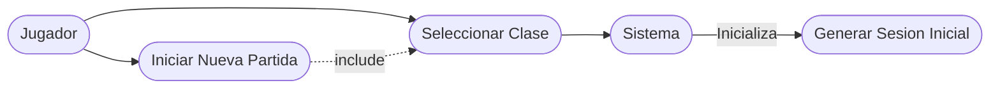

#### UC2: Explorar Nivel (Mazmorra Procedural)
| Campo | Descripción |
| --- | --- |
| **Nombre:** | Explorar Nivel |
| **Autor:** | Equipo de Arquitectura |
| **Fecha:** | 2026-04-09 |
| **Descripción:** | El jugador avanza a la siguiente sala de la campaña arrastrando el motor de generación procedural. |
| **Actores:** | Jugador, Sistema (GameRuntime) |
| **Precondiciones:** | El jugador debe encontrarse en una sesión activa de juego y la sala actual debe estar resuelta (vacía). |
| **Flujo Normal:** | 1. El Jugador emite la orden para "Avanzar de Sala".<br>2. El Sistema invoca al motor procedural a generar nueva celda.<br>3. El Sistema decide su contenido (ej. recompensa de tesoro o generador de monstruo).<br>4. Se actualiza el `GameContext` y el front visual. |
| **Flujo Alternativo:** | 3a. Al llegar al límite del bioma temático actual, el sistema avanza la campaña a su siguiente etapa (ej. Fire Theme a Dark Theme). |
| **Poscondiciones:** | El estado de la pantalla se muta para alojar al jugador resolviendo el contenido recién generado. |

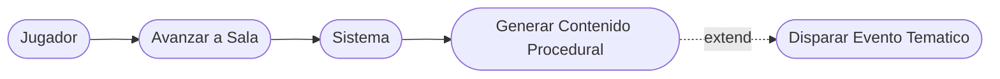

#### UC3: Entrar en Combate
| Campo | Descripción |
| --- | --- |
| **Nombre:** | Entrar en Combate |
| **Autor:** | Equipo de Arquitectura |
| **Fecha:** | 2026-04-09 |
| **Descripción:** | El jugador realiza interacción combativa usando estrategias por turnos ante el enemigo presente en la sala. |
| **Actores:** | Jugador, Sistema (GameRuntime) |
| **Precondiciones:** | Se generó un enemigo tras explorar la sala procedural y se levantó la bandera estatal de Combate. |
| **Flujo Normal:** | 1. El Jugador evalúa UI de combate.<br>2. Selecciona "Atacar" o "Defender".<br>3. El Sistema empareja en la tubería `Decorator` su efecto (ej. ataque de fuego).<br>4. El Sistema ejecuta en modo estrategia el turno hostil enemigo.<br>5. Bucle hasta vencer. |
| **Flujo Alternativo:** | 2a. Jugador opta por evadir daños abriendo inventario para curarse de urgencias.<br>4a. Si el héroe pierde salud total, disparo inmediato de sub-rutina de pérdida (Game Over). |
| **Poscondiciones:** | Limpieza de la entidad hostil de la zona y generación de paquete de tesoro reclamable. |

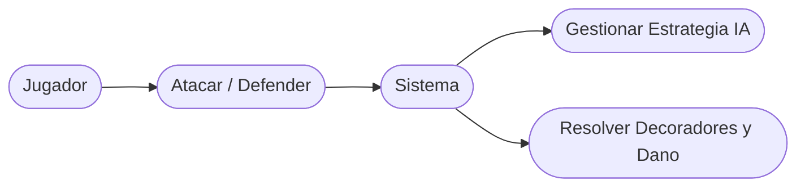

#### UC4: Gestionar Inventario
| Campo | Descripción |
| --- | --- |
| **Nombre:** | Gestionar Inventario |
| **Autor:** | Equipo de Arquitectura |
| **Fecha:** | 2026-04-09 |
| **Descripción:** | El jugador interactúa con artículos consumibles recolectados, administrados transversalmente en forma de árbol compuesto. |
| **Actores:** | Jugador |
| **Precondiciones:** | El héroe debe tener al menos un ítem agregado desde una sala de tesoro al inventario dinámico. |
| **Flujo Normal:** | 1. El Jugador abre sub-panel general de inventario.<br>2. Visualiza árbol Composite de carpetas u objetos planos.<br>3. Ejecuta "Mandar a Usar" sobre una poción de daño/curación.<br>4. El ítem afecta al jugador y desaparece de la estructura. |
| **Flujo Alternativo:** | 3a. El Jugador selecciona "Descartar" sin gastarlo o aplicarse buff alguno. |
| **Poscondiciones:** | Recalculo estadístico del estado base del jugador (Observer update a interfaz visual). |

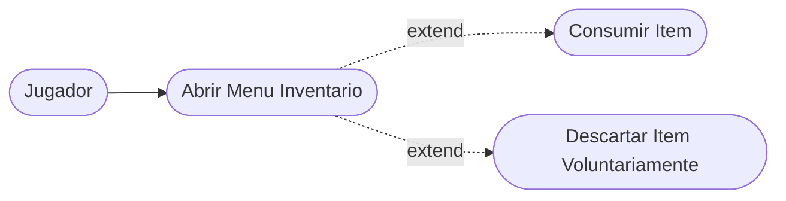

#### UC5: Guardar / Cargar Partida
| Campo | Descripción |
| --- | --- |
| **Nombre:** | Guardar / Cargar Partida |
| **Autor:** | Equipo de Arquitectura |
| **Fecha:** | 2026-04-09 |
| **Descripción:** | El jugador suspende su actual aventura salvando una placa congelada al disco físico de los hosts, o retomando. |
| **Actores:** | Jugador, Sistema (GameRuntime) |
| **Precondiciones:** | El jugador está en un punto seguro para invocar el autoguardado (Slot System). |
| **Flujo Normal:** | 1. El Jugador entra al sub-estado de guardar al final de una sala o menú.<br>2. El Sistema exige un slot numerado de ranura.<br>3. `GameCaretaker` extrae el `GameSessionMemento`.<br>4. Escritura JSON física al directorio local. |
| **Flujo Alternativo:** | 3a. Eventuales fallos de I/O son mitigados por el manejador global, el cual omite fallas fatales retornando UI alerta en su lugar. |
| **Poscondiciones:** | Se escribe un archivo final validado en `/game-saves/[...].json`. |

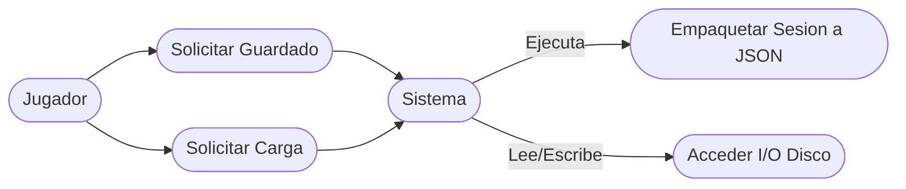

---

## 2. Requerimientos del Sistema

### 2.1 Requerimientos Funcionales (RF)
Se adjunta el histórico de Historias de Usuario (HU) operadas en el ciclo del proyecto:

| ID | Título de Historia | Descripción de Requerimiento | Prioridad | Estado |
|---|---|---|---|---|
| **HU-01** | Combate básico | El jugador debe poder atacar y defenderse frente a monstruos en cada sala a través de estrategias condicionales. | Alta | Implementada |
| **HU-02** | Selección de clase | Al iniciar partida, se debe seleccionar una de varias clases de Héroe, que inicializarán su propio árbol base. | Alta | Implementada |
| **HU-03** | Sistema de inventario | El usuario debe gestionar objetos complejos consumibles en un árbol de almacenamiento general jerárquico. | Media | Implementada |
| **HU-04** | Generación procedural | La mazmorra debe armarse dinámicamente mediante semillas deterministas. | Alta | Implementada |
| **HU-05** | Guardado/Carga | El progreso del jugador debe ser serializado al disco y restaurado sin perder la integridad del turno y estadísticas. | Alta | Implementada |

#### Diagrama de Flujo / Actividad del Proyecto (UML)
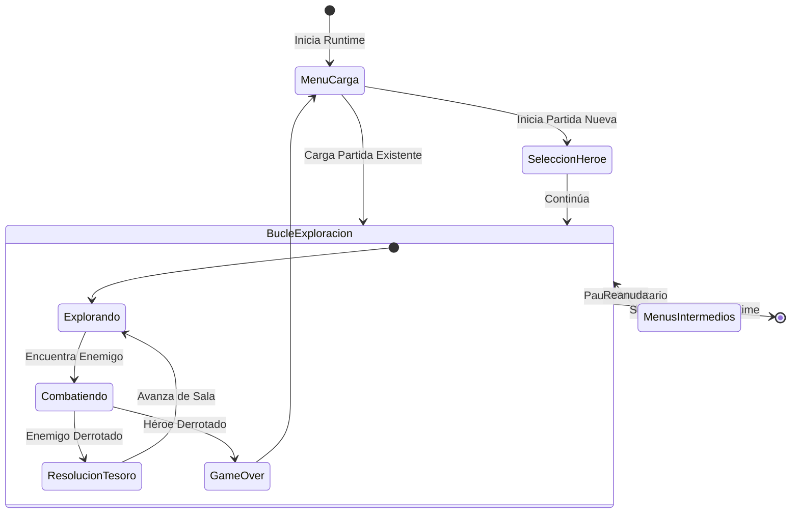

### 2.2 Requerimientos No Funcionales (RNF)
1. **Rendimiento**: Generación instantánea en determinismos in-memory. Tolerancia máxima de ejecución por turno de 200ms.
2. **Seguridad / Persistencia**: Guardado desacoplado en archivos locales, sin servicios red expuestos por diseño cerrado de la sesión en disco (slots 1 a N).
3. **Compatibilidad y Empaquetado**: Distribución de un solo cliente multi-plataforma. El entorno corre gracias a `jpackage`, generando de forma embebida `DEB`/`RPM`/`AppImage` (Linux) y `EXE` (Windows).
4. **Acoplamiento UI/Backend**: El uso del patrón arquitectónico Bridge para interactuar vía WebEngine garantiza que el núcleo puede correr en cualquier shell UI pura.

---

## 3. Diseño y Arquitectura (Estructura Técnica)

El sistema emplea un patrón monolítico fuertemente modularizado, donde la orquestación depende en su núcleo base del `GameRuntime`.

### 3.1 Arquitectura de Software
* `GameRuntime`: Orquestador principal que canaliza el flujo entrante hacia los Casos de Uso.
* `GameSession`: Contenedor principal de la fuente de verdad (estado general del héroe, nivel, recursos y estado temporal).
* `GameStateContext` & `GameFlowState`: Definen en qué ventana local nos encontramos, guiando al presentador.
* `GamePresenter`: Mapeador final del estado en modelo `GameViewModel` exportable a Web (JSON o Model) o CLI.
* `RuntimePayloadValidator`: Criterio estricto para las interacciones vía interfaces.

### 3.2 Diagramas Arquitectónicos Core (UML)

#### Diagrama de Clases (Visión Simplificada del Runtime)
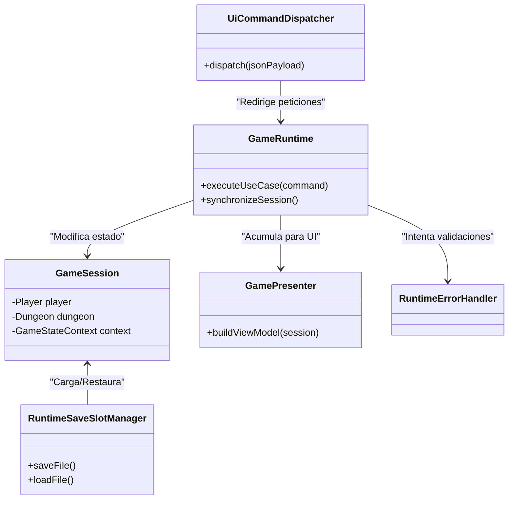

#### Diagrama de Secuencia (El flujo de Comando productivo)
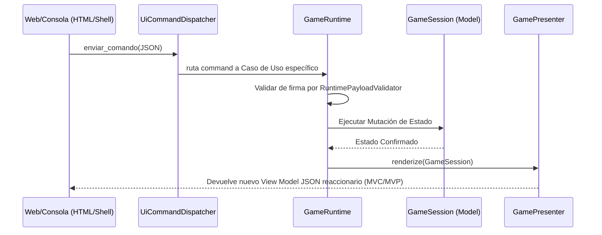

### 3.3 Patrones de Diseño Implementados
De los estamentos curriculares generados, esta arquitectura modela de forma determinista 11 patrones principales que sostienen las sub-mecanicas del sistema. Los patrones auxiliares se documentan por separado y no alteran el conteo academico oficial.

**1. Patrón State (Flujo)**
Desacopla a la UI de las condicionales y gobierna las reglas lógicas transicionales en `GameStateContext`.
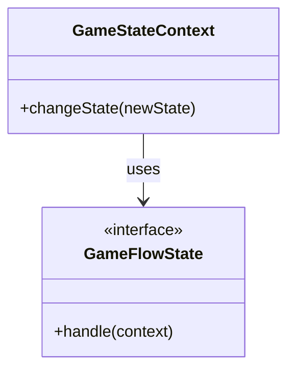

**2. Patrón Observer (Eventos)**
Integrado a partir del `EventManager`, reacciona a cambios productivos gracias a `SessionEventFeedObserver` y su propagador de notificaciones.
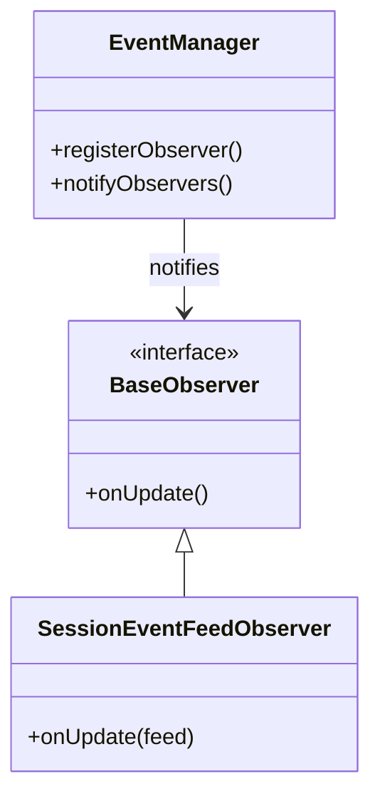

**3. Patrón Decorator (Combate y Afecciones)**
Transforma de manera flexible los modificadores (Ataque, Veneno, Fuego) apilando cálculos matemáticos en la tubería `CombatStatusDecoratorPipeline`.
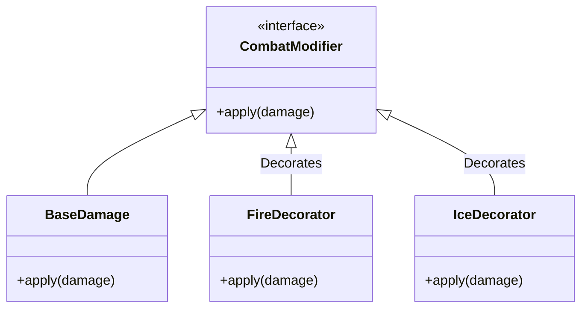

**4. Patrón Composite (Inventario)**
Abstracción de jerarquías que procesa hojas (ítems puros) o troncos (bolsas/clasificadores) de manera transparente para los bucles generales usando `ItemComponent`.
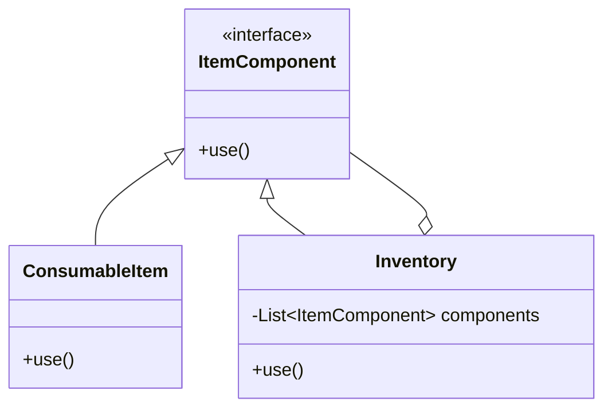

**5. Patrón Builder (Generación de Mapa Procedimental)**
Aporta una construcción gradual del `GameDungeon` delegando las reglas topológicas a través del motor `ProceduralDungeonGenerator`.
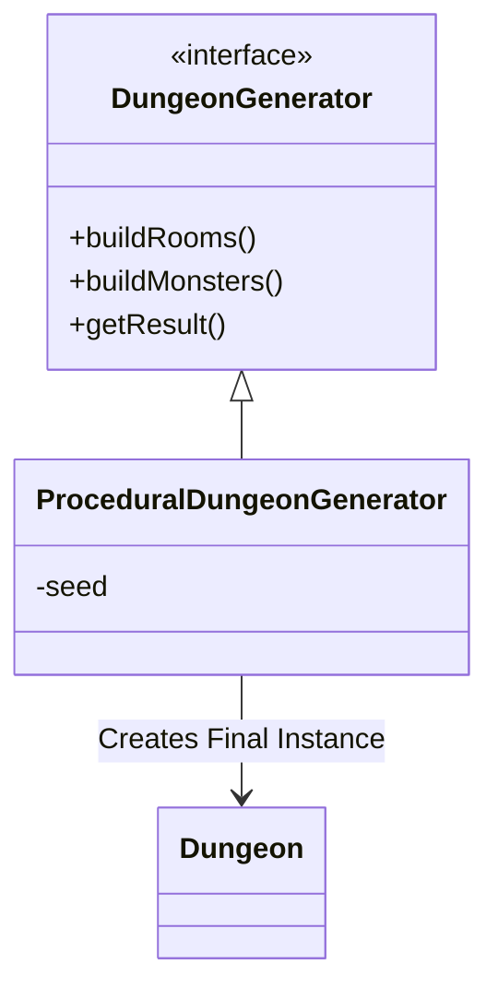

**6. Patrón Strategy (Estilos de Combate)**
Separa las rutinas de la lógica dura. Permite a los seres intercambiar IA implementando variaciones dentro de `CombatSystem`.
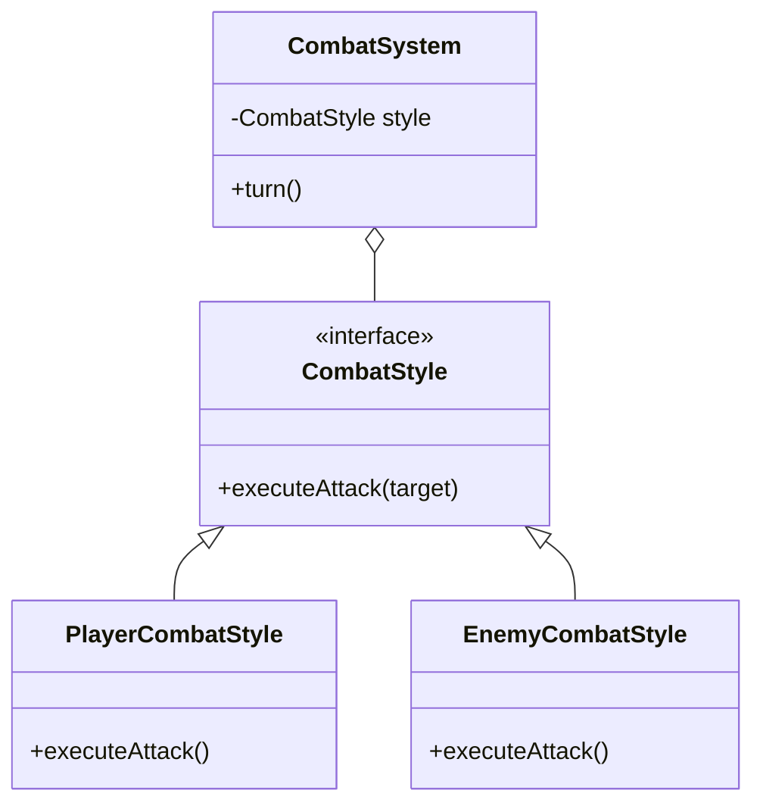

**7. Patrón Memento (Guardado Seguro)**
Toma una placa o representación estática de toda la `GameSession` hacia un `GameSessionMementoMapper` controlados por su `RuntimeSaveSlotManager`.
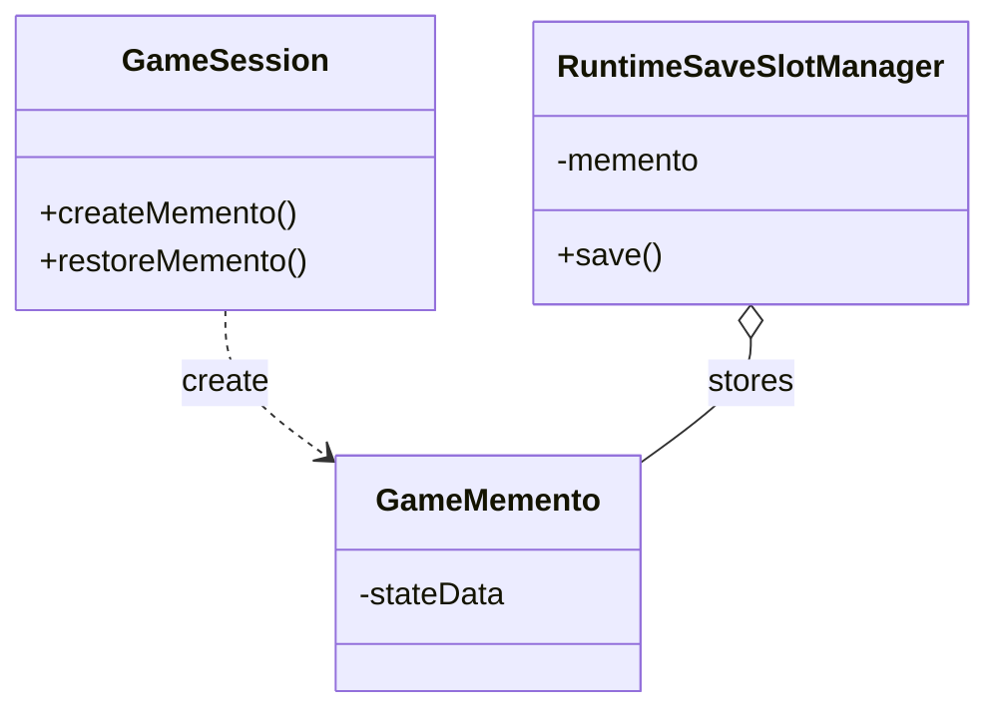

**8. Patrón Factory Method (Creacional)**
Define una interfaz para crear personajes, permitiendo a cada factory concreta decidir la instancia final sin acoplar al cliente.
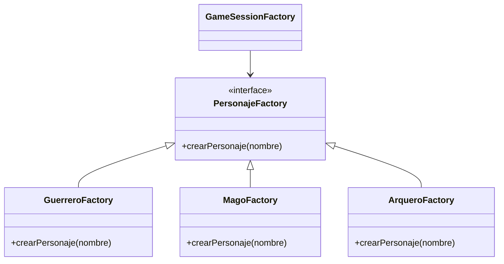

**9. Patrón Abstract Factory (Creacional)**
Proporciona una interfaz para crear familias de contenido por tema de mazmorra (fuego, hielo, oscuridad, veneno) sin acoplar al cliente a implementaciones concretas.
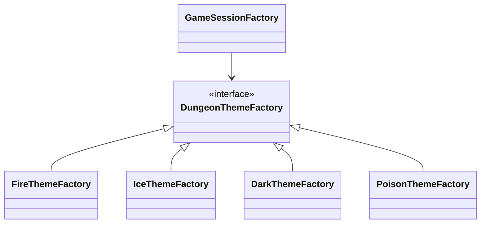

**10. Patrón Facade (Estructural)**
Provee una interfaz unificada para el subsistema de combate, simplificando inicio, rondas, cierre y estadisticas.
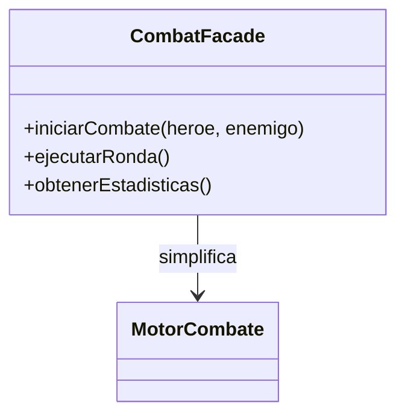

**11. Patrón Command (Comportamiento)**
Encapsula las peticiones del usuario o sistema en objetos, permitiendo enrutar las acciones al core sin acoplar UI.
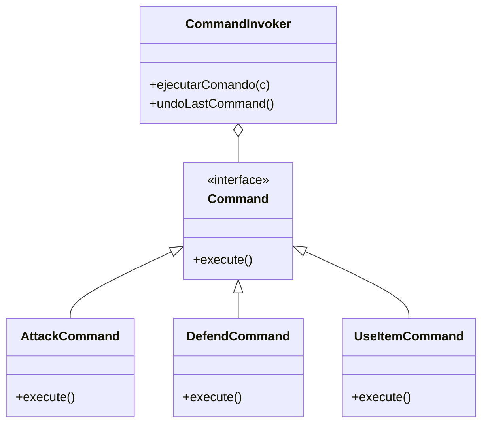

### 3.4 Patrones Auxiliares Implementados (no incluidos en el conteo de 11 principales)
Adicionalmente, se comprobaron integraciones activas en el código de aplicación orientados a instancias globales y polimorfismo de controladores:

**12. Patrón Singleton (Gestión de Eventos)**
Asegura la existencia de una única instancia operativa global en el ciclo de ejecución. Validado en la clase `EventManager`.
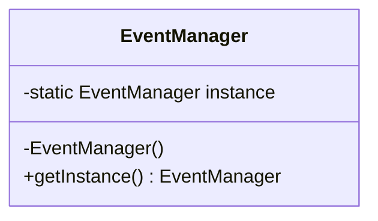

**13. Patrón Adapter (Integración de Visores)**
Permite interoperar entre la interfaz del núcleo principal y las representaciones visuales. Evidenciado en `ConsoleGameAdapter` y `WebGameAdapter`.
```mermaid
classDiagram
    class GameEngine {
        +start()
    }
    class ConsoleGameAdapter {
        +initializeCLI()
    }
    class WebGameAdapter {
        +initializeWeb()
    }
    ConsoleGameAdapter --> GameEngine : Adapta
    WebGameAdapter --> GameEngine : Adapta
```

---

## 4. Diseño de Datos y Despliegue

### 4.1 Modelo de Datos y Persistencia
No existe base de datos relacional externa. Por rendimiento y arquitectura monolítica robusta, el modelo de datos se resuelve dinámicamente con serialización JSON utilizando objetos de dominio plano (DTO / Mementos).
- **Entidades primordiales persistidas**: `Hero` (con stats), `Inventory` recursivo, `Dungeon` (id de cuartos, enemigos muertos, semillas), `GameFlowState`.
- La orquesta se efectúa dentro del `GameSessionMementoMapper`.
- Ubicación de almacenamiento en Runtime: `game-saves/`.

### 4.2 Diagrama de Despliegue Topológico (UML)
El siguiente diagrama detalla cómo se orquestan los archivos generados y cómo se comportan frente al S.O del host final donde ejecuta el jugador.

```mermaid
graph TB
    subgraph Cliente["Dispositivo del Cliente (Windows / Linux)"]
        subgraph Instalador["Instalable Distribuido (DEB/RPM/EXE)"]
            subgraph App["Aplicacion DungeonCrawler"]
                Frontend["Web/Consola Bin (Play.sh / JavaFX WebView)"]
                JRE["JRE Embebido (via jlink)"]
                Backend["DungeonCrawler Backend JAR"]

                Frontend -->|Runs on| JRE
                JRE -->|Executes| Backend
            end
        end

        DirectorioLocal[("game-saves / json files")]
    end

    Backend -->|Lectura / Escritura de Partidas (Memento)| DirectorioLocal
```

---
**Documento Generado por:** Auditoría Automática de Sistema y Consolidación de Arquitectura Runtime.
