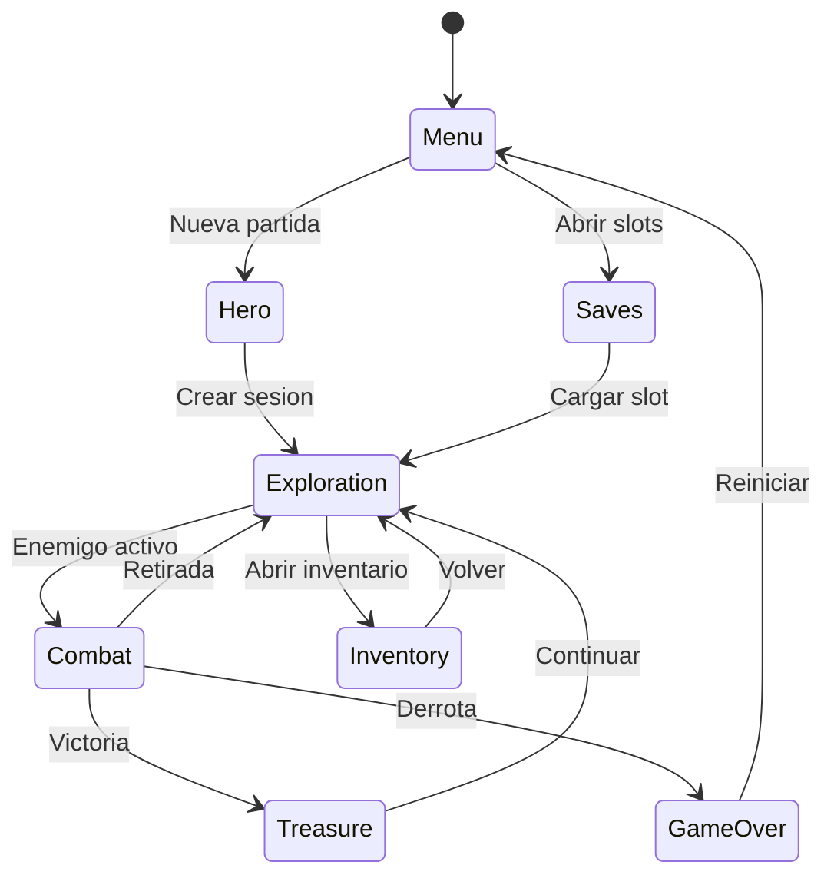
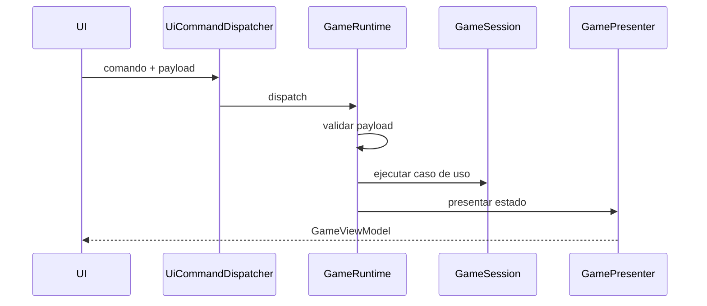

# Especificacion de Requerimientos del Sistema (ISO/IEC/IEEE 29148)

- Proyecto: Dungeon Crawler Patterns
- Fecha de actualizacion: 2026-04-24
- Estado: vigente
- Rol del documento: especificacion funcional y no funcional alineada con el runtime real

## Navegacion documental

- Indice documental: `docs/README.md`
- GDD canonico: `docs/01-product/GDD_CANONICO.md`
- Arquitectura runtime: `docs/02-architecture/ARQUITECTURA_RUNTIME.md`
- Patrones: `docs/03-patterns/README.md`
- Testing: `docs/04-testing/ESTRATEGIA_TESTING.md`
- Auditoria: `docs/05-audit/REVISION_FINAL_2026-04-24.md`

## 1. Introduccion

### 1.1 Proposito

El sistema tiene como objetivo demostrar implementacion verificable de patrones de diseno GoF en un videojuego por turnos construido en Java 17. La validacion academica no depende solo de descripciones teoricas: el proyecto mantiene trazabilidad entre requerimientos, arquitectura, clases productivas, pruebas automatizadas y documentacion canonica.

### 1.2 Alcance funcional vigente

El flujo soportado en runtime cubre:

- menu inicial
- seleccion de heroe
- inicio o carga de partida
- exploracion de mazmorra
- combate por turnos
- resolucion de tesoro post-combate
- inventario jerarquico con uso de items
- persistencia por slots
- progresion de campana por temas: `poison -> ice -> fire -> dark`

### 1.3 Fuera de alcance actual

- automatizacion E2E visual completa en navegador real
- servicios remotos o persistencia en red
- multijugador

## 2. Casos de uso principales

### UC-01 Iniciar partida

| Campo | Descripcion |
| --- | --- |
| Nombre | Iniciar partida |
| Actores | Jugador, Sistema (`GameRuntime`) |
| Precondicion | El runtime se encuentra inicializado |
| Flujo principal | El jugador abre nueva partida, selecciona `heroType` y `theme`, y el sistema crea una `GameSession` valida |
| Flujo alterno | El jugador elige cargar un slot existente |
| Poscondicion | La sesion queda lista en flujo de exploracion o menu segun el estado restaurado |

### UC-02 Explorar mazmorra

| Campo | Descripcion |
| --- | --- |
| Nombre | Explorar mazmorra |
| Actores | Jugador, Sistema |
| Precondicion | Existe una sesion activa |
| Flujo principal | El jugador avanza de sala y el sistema resuelve contenido procedural, progreso de campana y evento de sala |
| Flujo alterno | La exploracion activa combate, tesoro o cambio de etapa tematica |
| Poscondicion | La sesion refleja la nueva sala y su estado jugable |

### UC-03 Resolver combate

| Campo | Descripcion |
| --- | --- |
| Nombre | Resolver combate |
| Actores | Jugador, Sistema |
| Precondicion | Existe enemigo activo en la sala |
| Flujo principal | El jugador ejecuta acciones de combate y el sistema procesa estrategia, decoradores de estado, turnos y resultado |
| Flujo alterno | El jugador puede defender, usar habilidad, retroceder o terminar en `gameover` |
| Poscondicion | El combate termina en victoria, derrota o retiro |

### UC-04 Gestionar inventario

| Campo | Descripcion |
| --- | --- |
| Nombre | Gestionar inventario |
| Actores | Jugador |
| Precondicion | La sesion posee items disponibles |
| Flujo principal | El jugador abre inventario, navega la estructura composite y usa o vende items |
| Flujo alterno | El jugador cambia seleccion o vuelve al flujo anterior |
| Poscondicion | El inventario y las estadisticas de sesion quedan sincronizados |

### UC-05 Guardar y cargar partida

| Campo | Descripcion |
| --- | --- |
| Nombre | Guardar y cargar partida |
| Actores | Jugador, Sistema |
| Precondicion | Existe una sesion valida para persistir o restaurar |
| Flujo principal | El sistema guarda o carga desde `RuntimeSaveSlotManager` usando memento y almacenamiento local |
| Flujo alterno | El runtime rechaza slots invalidos o estados incompatibles |
| Poscondicion | La sesion queda persistida o restaurada de forma consistente |

## 3. Requerimientos funcionales

| ID | Requerimiento | Estado |
| --- | --- | --- |
| RF-01 | El sistema debe permitir iniciar una nueva partida seleccionando heroe y tema de campana | Implementado |
| RF-02 | El sistema debe permitir cargar una partida desde slots persistidos | Implementado |
| RF-03 | El sistema debe soportar exploracion de salas y progresion de campana | Implementado |
| RF-04 | El sistema debe resolver combates por turnos con acciones del jugador y respuesta enemiga | Implementado |
| RF-05 | El sistema debe administrar inventario jerarquico y uso real de items | Implementado |
| RF-06 | El sistema debe guardar y restaurar sesion mediante memento | Implementado |
| RF-07 | El sistema debe presentar el estado tanto en GUI como en consola mediante el mismo runtime | Implementado |
| RF-08 | El sistema debe validar comandos y payloads antes de mutar la sesion | Implementado |

## 4. Requerimientos no funcionales

| ID | Requerimiento | Estado |
| --- | --- | --- |
| RNF-01 | El sistema debe ejecutarse en Java 17 | Vigente |
| RNF-02 | El runtime debe conservar una unica fuente de verdad de sesion en `GameSession` | Vigente |
| RNF-03 | La persistencia debe operar con archivos locales y slots controlados | Vigente |
| RNF-04 | La arquitectura debe permitir UI web y consola sobre el mismo nucleo | Vigente |
| RNF-05 | La validacion academica debe apoyarse en pruebas automatizadas reales | Vigente |
| RNF-06 | La documentacion debe mantener una sola fuente de verdad por concepto en `docs/` | Vigente |
| RNF-07 | El empaquetado debe contemplar Linux y Windows mediante `jpackage` | Vigente |

## 5. Arquitectura y trazabilidad tecnica

### 5.1 Componentes canonicamente vigentes

- `game.application.runtime.GameRuntime`: orquestador de comandos UI hacia casos de uso
- `game.application.state.GameSession`: fuente de verdad del estado de sesion
- `game.state.game.GameStateContext`: control del flujo por estados
- `game.application.state.GameFlowState`: estados tipados del runtime
- `game.ui.integration.GamePresenter`: adaptacion de sesion a `GameViewModel`
- `game.application.runtime.RuntimePayloadValidator`: validacion estructural y semantica de comandos
- `game.application.runtime.RuntimeSaveSlotManager`: guardado/carga por slots
- `game.application.runtime.CampaignSessionCoordinator`: continuidad de campana y heroe

### 5.2 Flujo productivo soportado

1. La UI envia un comando.
2. `UiCommandDispatcher` valida estructura basica y delega en `GameRuntime`.
3. `GameRuntime` valida payload, ejecuta el caso de uso y sincroniza la sesion.
4. `GamePresenter` genera el `GameViewModel`.
5. La UI web o consola renderiza el nuevo estado.

## 6. Patrones de diseno implementados

Conteo academico oficial vigente: `11`.

| Patron | Artefacto principal |
| --- | --- |
| State | `GameStateContext`, `GameFlowState`, estados de juego |
| Observer | `EventManager`, `SessionEventFeedObserver`, `SessionEventCounterObserver` |
| Decorator | `CombatStatusDecoratorPipeline`, efectos de estado |
| Composite | `Inventory`, `ItemComponent`, `ContainerItem` |
| Builder | `ProceduralDungeonGenerator`, `DungeonBuilder`, `DungeonDirector` |
| Memento | `GameSessionMementoMapper`, `GameCaretaker`, `RuntimeSaveSlotManager` |
| Strategy | `CombatSystem`, `AIStrategy`, estilos de combate |
| Factory Method | `PersonajeFactory` y factories concretas |
| Abstract Factory | `DungeonThemeFactory` y temas concretos |
| Facade | `CombatFacade` |
| Command | `Command`, `CommandInvoker`, acciones de comando |

La descripcion detallada y la evidencia por patron se mantienen en `docs/03-patterns/*.md`.

## 7. Metricas reales verificadas

Verificacion realizada sobre el arbol actual del repositorio el `2026-04-24`.

| Metrica | Valor real | Metodo de verificacion |
| --- | --- | --- |
| Archivos `.java` productivos en `src/main/java` | `160` | `find src/main/java -name '*.java'` |
| Artefactos Java productivos excluyendo `package-info.java` | `151` | `find src/main/java -name '*.java' | grep -v 'package-info.java'` |
| Clases de test en `src/test/java` | `48` | `find src/test/java -name '*Test.java'` |
| Tests ejecutados | `221` | `mvn test -q` + resumen de `target/surefire-reports` |
| Fallos | `0` | `target/surefire-reports/*.xml` |
| Errores | `0` | `target/surefire-reports/*.xml` |
| Omitidos | `0` | `target/surefire-reports/*.xml` |

### 7.1 Distribucion general del codigo productivo

- `game/application`: 52 artefactos Java
- `game/domain`: 28 artefactos Java
- `game/ui`: 13 artefactos Java
- `game/state`: 12 artefactos Java
- `game/dungeon`: 12 artefactos Java
- `game/patterns`: 9 artefactos Java
- `game/infrastructure`: 9 artefactos Java

### 7.2 Distribucion general de pruebas

- `game/unit/application`: 14 clases de test
- `game/unit/domain`: 6 clases de test
- `game/unit/creational`: 5 clases de test
- `game/unit/behavioral`: 5 clases de test
- `game/unit/ui`: 3 clases de test
- `game/unit/structural`: 3 clases de test
- `game/integration/behavioral`: 3 clases de test

La fuente de verdad documental de la metrica operativa de testing sigue siendo `docs/04-testing/ESTRATEGIA_TESTING.md`.

## 8. Persistencia y despliegue

### 8.1 Persistencia

- No se utiliza base de datos externa.
- La sesion se serializa mediante memento.
- El almacenamiento se realiza en `game-saves/`.
- Los slots son gestionados por `RuntimeSaveSlotManager`.

### 8.2 Ejecucion y empaquetado

- Inicio de entorno Java: `source scripts/setup-java.sh`
- Ejecucion consola: `./scripts/play.sh`
- Ejecucion GUI: `./scripts/play-gui.sh`
- Tests: `mvn test`
- Empaquetado Linux: `./scripts/package-linux.sh`
- Empaquetado Windows: `.\scripts\package-windows.ps1`

## 9. Regla de interpretacion documental

- Este documento resume requerimientos vigentes del sistema.
- El detalle de producto vive en `docs/01-product/GDD_CANONICO.md`.
- La arquitectura fuente de verdad vive en `docs/02-architecture/ARQUITECTURA_RUNTIME.md`.
- La metrica oficial de testing vive en `docs/04-testing/ESTRATEGIA_TESTING.md`.
- Si existiera conflicto entre este documento y una fuente canonica por concepto, prevalece la fuente canonica especifica.
