# Patrones de Diseño Unificados — Dungeon Crawler

**Fecha de Consolidación:** 13 de abril de 2026  
**Estado:** ✅ Remediado e integrado en runtime productivo  
**Rama:** Refactorizacion

---

## Tabla de Contenidos

1. [Introducción](#introducción)
2. [Patrones Creacionales](#patrones-creacionales)
3. [Patrones Estructurales](#patrones-estructurales)
4. [Patrones de Comportamiento](#patrones-de-comportamiento)
5. [Estadísticas del Proyecto](#estadísticas)

---

## Introducción

Este documento consolida la implementación de **11 patrones de diseño** en el núcleo productivo del Dungeon Crawler. Cada patrón resuelve un problema específico de arquitectura y ha sido validado mediante tests unitarios, de integración y end-to-end.

**Principios de Integración:**
- ✅ Todas las rutas y clases son productivas (no legacy)
- ✅ Cada patrón incluye validación de integración
- ✅ Se han eliminado rutas paralelas e inconsistencias
- ✅ Aislamiento de sesión garantizado (multi-sesión safe)

---

## Matriz de Patrones

| Patron | Categoria | Clase/paquete ancla | Test principal |
|---|---|---|---|
| Abstract Factory | Creacional | `game.dungeon.theme` | `AbstractFactoryTest` |
| Builder | Creacional | `game.dungeon.builder` | `BuilderPatternTest` |
| Factory Method | Creacional | `game.domain.personaje.factory` | `FactoryMethodTest` |
| Composite | Estructural | `game.items.model` | `CompositePatternTest` |
| Decorator | Estructural | `game.effects.status` | `DecoratorPatternTest` |
| Facade | Estructural | `game.patterns.combat.facade` | `FacadePatternTest` |
| Command | Comportamiento | `game.patterns.command.actions` | `CommandPatternTest` |
| Memento | Comportamiento | `game.infrastructure.persistence.memento` | `MementoPatternTest` |
| Observer | Comportamiento | `game.infrastructure.events.observer` | `ObserverPatternTest` |
| State | Comportamiento | `game.state.game` | `StatePatternTest` |
| Strategy | Comportamiento | `game.ai.strategy` | `StrategyPatternTest` |

---

# Patrones Creacionales

## 1. Abstract Factory

**Categoría:** Creacional | **Complejidad:** Medio

### Problema que resuelve

El juego necesita crear familias coherentes de contenido por tema de mazmorra (fuego, hielo, oscuridad, veneno) sin mezclar reglas de cada tema. Garantiza que los enemigos, loot y resistencias elementales sean consistentes dentro de cada tema.

### Clases Principales

| Clase | Ubicación |
|-------|-----------|
| `DungeonThemeFactory` | `game.dungeon.theme` |
| `FireThemeFactory` | `game.dungeon.theme` |
| `IceThemeFactory` | `game.dungeon.theme` |
| `DarkThemeFactory` | `game.dungeon.theme` |
| `PoisonThemeFactory` | `game.dungeon.theme` |
| `GameSessionFactory` | `game.application.state` |

### Contratos por Tema

| Tema | Resistencia (Básico/Jefe) | Loot Temático |
|------|---------|------------|
| Fuego | Fire +20 / +100 | Espada Flamígera |
| Hielo | Ice +20 / +100 | Báculo del Invierno |
| Veneno | Poison +20 / +100 | Daga del Asesino |
| Oscuridad | Dark +20 / +100 | Armadura de las Sombras |

### Diagrama

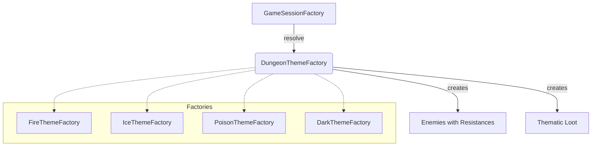

### Validación

- `AbstractFactoryTest.testContratoResistenciasPorTema`
- `AbstractFactoryTest.testMapeoTemaRuntimeEnSessionFactory`

---

## 2. Builder

**Categoría:** Creacional | **Complejidad:** Medio

### Problema que resuelve

El juego requiere construir mazmorras reproducibles por semilla y variables por tema sin acoplar la construcción a una sola configuración fija.

### Clases Principales

| Clase | Ubicación |
|-------|-----------|
| `DungeonDirector` | `game.dungeon.builder` |
| `DungeonBuilder` | `game.dungeon.builder` |
| `ConcreteDungeonBuilder` | `game.dungeon.builder` |
| `ProceduralDungeonGenerator` | `game.dungeon.builder` |
| `Dungeon` | `game.domain.exploration` |

### Cadena de Invocación

```
GameSessionFactory 
  → DungeonDirector.buildForTheme(theme, seed)
    → ProceduralDungeonGenerator
      → ConcreteDungeonBuilder
        → Dungeon aggregate
```

### Diagrama

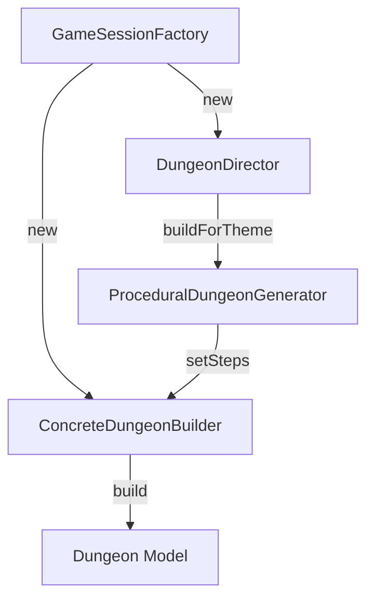

### Validación

- `BuilderPatternTest.testDeterminismoSemilla`: Estructura constante para semilla dada
- Equivalencia: Mismo resultado bajo misma semilla

---

## 3. Factory Method

**Categoría:** Creacional | **Complejidad:** Bajo

### Problema que resuelve

Evita instanciación directa de tipos concretos en el flujo de runtime. Las factories de tema delegan la creación de enemigos, y `GameSessionFactory` hace lo mismo con héroes.

### Clases Principales

| Clase | Ubicación |
|-------|-----------|
| `PersonajeFactory` | `game.domain.personaje.factory` |
| `GuerreroFactory` | `game.domain.personaje.factory` |
| `MagoFactory` | `game.domain.personaje.factory` |
| `ArqueroFactory` | `game.domain.personaje.factory` |
| `DragonFactory` | `game.domain.personaje.factory` |
| `OrcoFactory` | `game.domain.personaje.factory` |
| `EnemigoBasicoFactory` | `game.domain.personaje.factory` |
| `GameSessionFactory` | `game.application.state` |

### Cadena Real de Invocación

```
GameRuntime
  → CampaignSessionCoordinator
    → GameSessionFactory.createSessionForThemeRandomized(...)
      → createPlayerForHero(...) [PersonajeFactory]
      → DungeonThemeFactory.crearEnemigoBasico/Medio/Jefe
```

### Diagrama

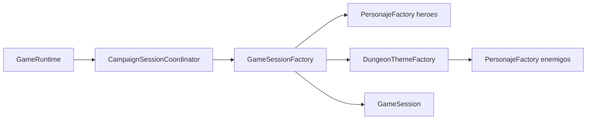

### Validación

- `FactoryMethodTest` para `DragonFactory` y `OrcoFactory`
- `GameRuntimeHeroSelectionTest`: Tipos compatibles

---

# Patrones Estructurales

## 4. Composite

**Categoría:** Estructural | **Complejidad:** Alto

### Problema que resuelve

El inventario del jugador necesita manejar estructuras jerárquicas (contenedores anidados) permitiendo operaciones uniformes, con persistencia íntegra del árbol.

### Clases Principales

| Clase | Ubicación |
|-------|-----------|
| `ItemComponent` | `game.items.model` |
| `ContainerItem` | `game.items.model` |
| `SimpleItem` | `game.items.model` |
| `Inventory` | `game.domain.inventory` |
| `GameSessionMementoMapper` | `game.application.state` |

### Operaciones Clave

- `simpleItems()`: Aplanado para UI sin perder integridad
- `removeSimpleItemRecursive(parent, target)`: Búsqueda profunda
- `exportTree()`: Copia profunda para persistencia
- `importTree(root)`: Reconstrucción de jerarquía

### Diagrama

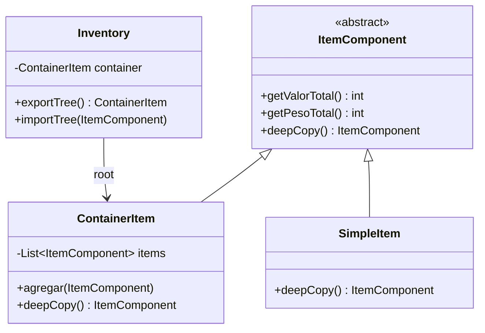

### Validación

- `CompositeIntegrationTest`: Integridad de jerarquía en save/load
- `InventoryTest`: Clonación profunda

---

## 5. Decorator

**Categoría:** Estructural | **Complejidad:** Alto

### Problema que resuelve

El combate requiere aplicar efectos de estado acumulables (veneno, quemadura, aturdimiento, buffs) sin multiplicar ramas condicionales.

### Clases Principales

| Clase | Ubicación |
|-------|-----------|
| `CharacterDecorator` | `game.effects.status` |
| `PoisonEffect` | `game.effects.status` |
| `BurnEffect` | `game.effects.status` |
| `StunEffect` | `game.effects.status` |
| `StrengthEffect` | `game.effects.status` |
| `GuardEffect` | `game.effects.status` |
| `CombatStatusDecoratorPipeline` | `game.domain.combat` |
| `Combat` | `game.domain.combat` |

### Política de Stacking

- **Límite Máximo:** 3 acumulaciones por efecto
- **Consumo:** Buffs se consumen tras uso; ticks de daño según duración

### Métodos Clave

- `applyStackingBuff(type)`: Punto de entrada
- `startPlayerTurn()`: Procesa efectos de inicio de turno
- `applyOutgoingModifiers(baseDamage)`: Cálculo de daño saliente
- `applyIncomingMitigation(enemyTurn)`: Cálculo de mitigación

### Validación

- `CombatDecoratorIntegrationTest`: Flujo completo
- `ApplyCombatBuffUseCaseTest`: Emisión de eventos
- `DecoratorPatternTest`: Estructura técnica

---

## 6. Facade

**Categoría:** Estructural | **Complejidad:** Medio

### Problema que resuelve

El runtime necesita un punto de entrada único para combate sin conocer los subsistemas internos.

### Clases Principales

| Clase | Ubicación |
|-------|-----------|
| `CombatFacade` | `game.patterns.combat.facade` |
| `Combat` | `game.domain.combat` |
| `CombatSystem` | `game.domain.combat` |
| `TurnManager` | `game.domain.turn` |
| `CombatStatusDecoratorPipeline` | `game.domain.combat` |

### Métodos Públicos Productivos

```
start(Enemy, bossFight)
finish() / isActive()
currentEnemy() / isBossFight()
attack(targetId, themeKey) / defend(themeKey)
useSkill(skillName, themeKey) / useItem(item, themeKey)
retreatAttempt(heroType, themeKey)
setCombatStyle(style, themeKey)
applyStackingBuff(buffType, themeKey)
resolveTurn()
```

### Diagrama

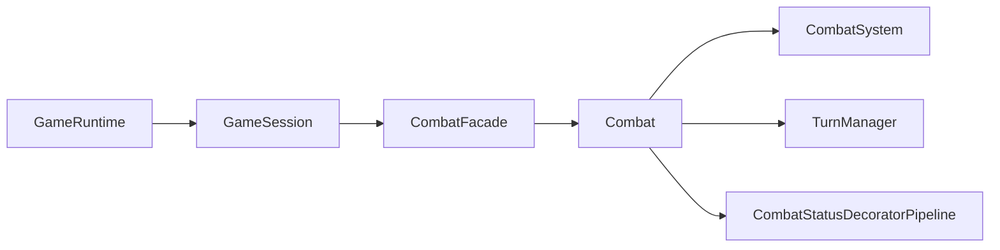

### Validación

- `FacadePatternTest`: Tests unitarios
- `FacadeIntegrationTest`: Integración

---

# Patrones de Comportamiento

## 7. Command

**Categoría:** Comportamiento | **Complejidad:** Medio

### Problema que resuelve

Unifica la ejecución de acciones de combate e inventario para evitar rutas paralelas y mantener historial trazable.

### Clases Principales

| Clase | Ubicación |
|-------|-----------|
| `Command` | `game.patterns.command.actions` |
| `AttackCommand` | `game.patterns.command.actions` |
| `DefendCommand` | `game.patterns.command.actions` |
| `SkillCommand` | `game.patterns.command.actions` |
| `UseItemCommand` | `game.patterns.command.actions` |
| `LevelUpCommand` | `game.patterns.command.actions` |
| `CommandInvoker` | `game.patterns.command.actions` |

### Interfaz Command

```java
void execute()
void undo()  // lanza excepción si no es reversible
boolean canExecute()
String getDescription()
```

### Reversibilidad

- `AttackCommand`: ❌ No reversible
- `DefendCommand`: ✅ Reversible
- `SkillCommand`: ✅ Reversible
- `UseItemCommand`: ❌ No reversible

### Diagrama

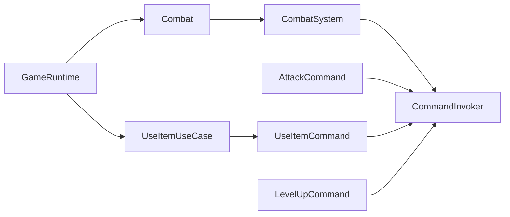

### Validación

- `CommandPatternTest`: Tests unitarios
- `BehavioralPatternsIntegrationTest`: Integración

---

## 8. Memento

**Categoría:** Comportamiento | **Complejidad:** Alto

### Problema que resuelve

El sistema necesita persistir y restaurar sesiones completas garantizando integridad de datos y permitiendo rollbacks ante fallos.

### Clases Principales

| Clase | Ubicación |
|-------|-----------|
| `GameMemento` | `game.application.state` |
| `GameSessionMementoMapper` | `game.application.state` |
| `GameCaretaker` | `game.infrastructure.persistence.memento` |
| `UseCaseTransactionSupport` | `game.application.usecase` |

### Schema Versioning

```
GameMemento v1.0
  → toMemento(): Setea versión actual
  → restoreStrict(): Valida versión, lanza SaveDataCorruptionException
```

### Flujo Productivo

```
GameRuntime
  → SaveGameUseCase / LoadGameUseCase
    → GameSessionMementoMapper
      → GameMemento v1.0 (snapshot)
      → GameCaretaker (persist)
        → Disk/Memory slots
```

### Diagrama

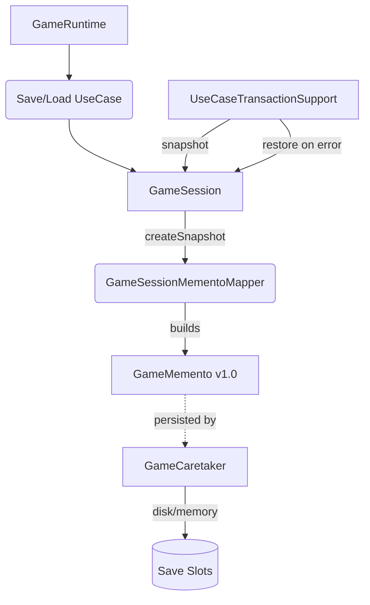

### Validación

- Esquema: Protección contra versiones antiguas
- Integración: Persistencia y restauración real
- Transacción: Atomicidad de casos de uso

---

## 9. Observer

**Categoría:** Comportamiento | **Complejidad:** Medio

### Problema que resuelve

El sistema necesita reaccionar a eventos de juego sin acoplar emisores a consumidores. **Aislamiento de sesión** evita que eventos de una partida se filtren en otra.

### Clases Principales

| Clase | Ubicación |
|-------|-----------|
| `EventManager` | `game.infrastructure.events.observer` |
| `GameObserver` | `game.application.ports.events` |
| `SessionEventFeedObserver` | `game.application.observer` |
| `SessionEventCounterObserver` | `game.application.observer` |
| `CombatLogger` | `game.infrastructure.events.observer` |
| `StatisticsTracker` | `game.infrastructure.events.observer` |
| `UINotifier` | `game.infrastructure.events.observer` |
| `GameSessionFactory` | `game.application.state` |

### Modelo de Aislamiento

```
GameSessionFactory
  → new EventManager() [instancia local por sesión]
    → new GameSession(manager)
      → new SessionEventFeedObserver(session)
      → new SessionEventCounterObserver(session)
      → manager.suscribir(observer)
```

### Thread-Safety

- `CopyOnWriteArrayList` internamente
- Prevención de `ConcurrentModificationException`
- Validación de doble suscripción

### Diagrama

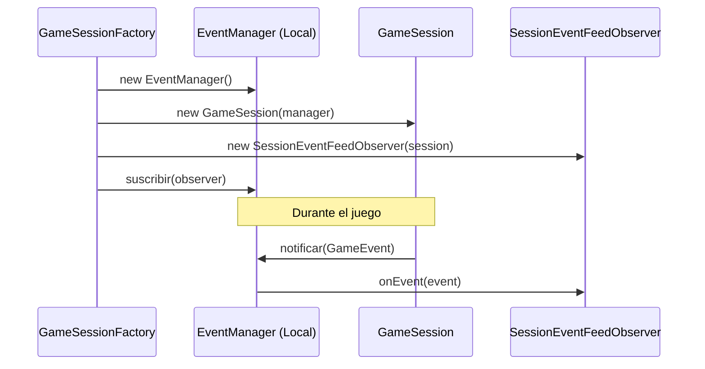

### Validación

- `EventObserversRuntimeIntegrationTest`: Aislamiento multi-sesión
- `ObserverPatternTest`: Contrato y thread-safety

---

## 10. State

**Categoría:** Comportamiento | **Complejidad:** Medio

### Problema que resuelve

El runtime necesita que el estado activo gobierne qué acciones son válidas y qué transiciones están permitidas.

### Clases Principales

| Clase | Ubicación |
|-------|-----------|
| `GameStateContext` | `game.state.game` |
| `GameState` | `game.state.game` |
| `MenuState` | `game.state.game` |
| `ExplorationState` | `game.state.game` |
| `CombatState` | `game.state.game` |
| `InventoryState` | `game.state.game` |
| `GameOverState` | `game.state.game` |

### Transiciones Válidas Productivas

```
menu → hero | saves | stats | exploration
hero → exploration | menu | saves | stats
exploration → combat | inventory | saves | stats | treasure | menu | hero | gameover
combat → treasure | exploration | inventory | gameover
inventory → exploration | combat | saves | menu
treasure → exploration | hero | menu
stats → menu
saves → exploration | menu | hero | gameover
gameover → menu | saves | hero | exploration
```

### Cadena de Validación

```
GameRuntime.handleCommand(action)
  → GameSession.assertActionAllowed(action)
    → GameStateContext.assertAccionPermitida(action)
      → GameState (activo).esAccionPermitida(action)
```

### Diagrama

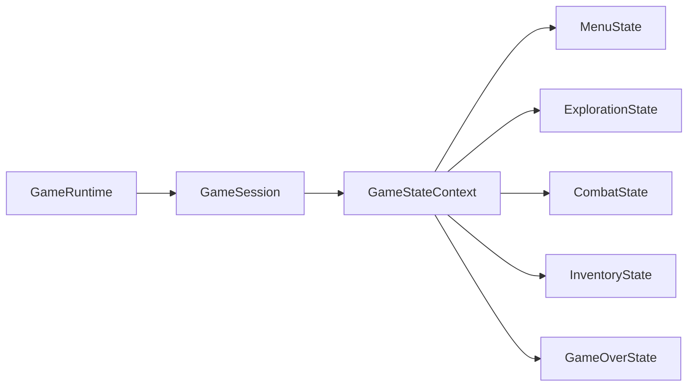

### Validación

- `StatePatternTest`: Acción/transición bloqueadas
- `GameRuntimeStateFlowIntegrationTest`: Flujo completo

---

## 11. Strategy

**Categoría:** Comportamiento | **Complejidad:** Medio

### Problema que resuelve

El combate necesita comportamiento variable sin condicionales monolíticos. IA enemiga adaptativa y estilo táctico del jugador configurable.

### Clases Principales

| Clase | Ubicación |
|-------|-----------|
| `AIStrategy` | `game.ai.strategy` |
| `AggressiveStrategy` | `game.ai.strategy` |
| `IntelligentStrategy` | `game.ai.strategy` |
| `DefensiveStrategy` | `game.ai.strategy` |
| `RandomStrategy` | `game.ai.strategy` |
| `PlayerCombatStyle` | `game.domain.combat` |
| `CombatSystem` | `game.domain.combat` |

### Lógica de Selección Enemiga

| Umbral de Vida | Estrategia | Comportamiento |
|---|---|---|
| > 75% | AggressiveStrategy | Prioriza heroe con más HP |
| 50-75% | IntelligentStrategy | Analiza debilidades |
| 25-50% | DefensiveStrategy | Postura defensiva |
| < 25% | IntelligentStrategy | Modo desesperado |

### Estilos del Jugador

- Cambio en tiempo real
- Consumo de recurso (Stamina/Maná)
- Validación de precondiciones
- Multiplicadores de daño/mitigación

### Diagrama

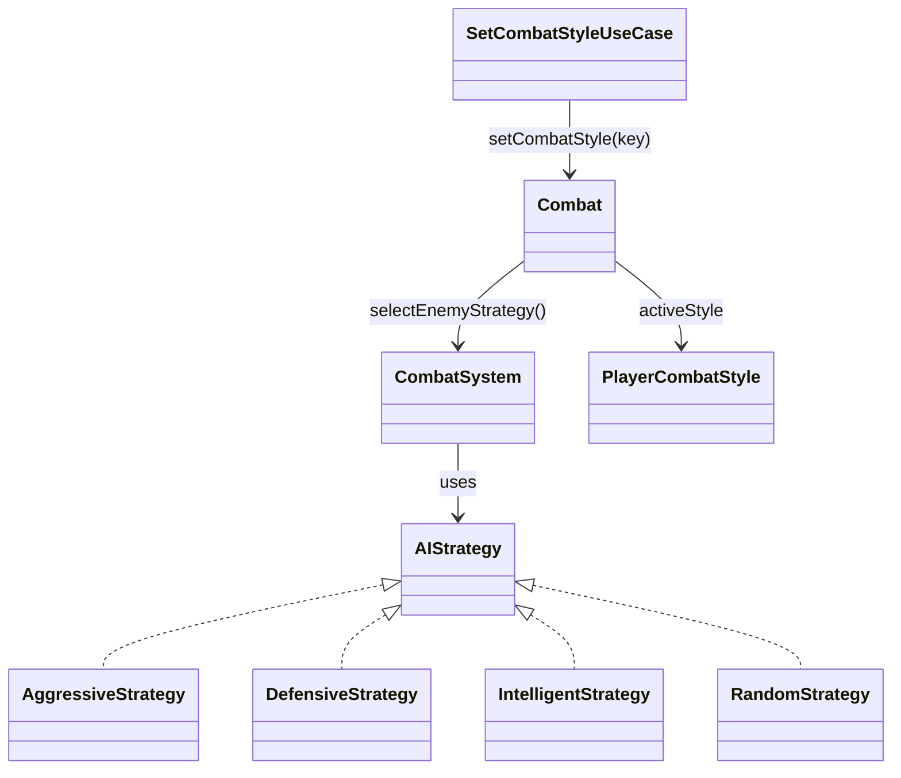

### Validación

- `StrategyPatternTest`: Contrato de estrategias
- `CombatSystemTest`: Cambio dinámico según daño

---

# Estadísticas

| Métrica | Valor |
|---------|-------|
| **Patrones Implementados** | 11 |
| **Patrones Creacionales** | 3 |
| **Patrones Estructurales** | 3 |
| **Patrones de Comportamiento** | 5 |
| **Clases de Patrón** | ~100+ |
| **Tests de Validación** | 50+ |
| **Inversión de Dependencias** | ✅ Activa |
| **Aislamiento de Sesión** | ✅ Garantizado |

---

## Recursos

- **Documentación Individual:** `docs/03-patterns/*.md`
- **Tests:** `src/test/java/game/unit/behavioral/`, `src/test/java/game/integration/`
- **Código Productivo:** `src/main/java/game/`

---

**Último Mantenimiento:** 13 de abril de 2026  
**Responsable:** Equipo de Arquitectura  
**Estado:** ✅ Producción
# Patrones de Diseño Unificados — Dungeon Crawler

**Fecha de Consolidación:** 13 de abril de 2026  
**Estado:** ✅ Remediado e integrado en runtime productivo  
**Rama:** Refactorizacion

---

## Tabla de Contenidos

1. [Introducción](#introducción)
2. [Patrones Creacionales](#patrones-creacionales)
   - [Abstract Factory](#abstract-factory)
   - [Builder](#builder)
   - [Factory Method](#factory-method)
3. [Patrones Estructurales](#patrones-estructurales)
   - [Composite](#composite)
   - [Decorator](#decorator)
   - [Facade](#facade)
4. [Patrones de Comportamiento](#patrones-de-comportamiento)
   - [Command](#command)
   - [Memento](#memento)
   - [Observer](#observer)
   - [State](#state)
   - [Strategy](#strategy)
5. [Estadísticas del Proyecto](#estadísticas)

---

## Introducción

Este documento consolida la implementación de **11 patrones de diseño** en el núcleo productivo del Dungeon Crawler. Cada patrón resuelve un problema específico de arquitectura y ha sido validado mediante tests unitarios, de integración y end-to-end.

**Principios de Integración:**
- ✅ Todas las rutas y clases son productivas (no legacy)
- ✅ Cada patrón incluye validación de integración
- ✅ Se han eliminado rutas paralelas e inconsistencias entre documentación y código
- ✅ A islamiento de sesión garantizado (multi-sesión safe)

---

## Matriz de Patrones

| Patron | Categoria | Clase/paquete ancla | Test principal |
| --- | --- | --- | --- |
| Abstract Factory | Creacional | `game.dungeon.theme` | `AbstractFactoryTest` |
| Builder | Creacional | `game.dungeon.builder` | `BuilderPatternTest` |
| Factory Method | Creacional | `game.domain.personaje.factory` | `FactoryMethodTest` |
| Composite | Estructural | `game.items.model` | `CompositePatternTest` |
| Decorator | Estructural | `game.effects.status` | `DecoratorPatternTest` |
| Facade | Estructural | `game.patterns.combat.facade` | `FacadePatternTest` |
| Command | Comportamiento | `game.patterns.command.actions` | `CommandPatternTest` |
| Memento | Comportamiento | `game.infrastructure.persistence.memento` | `MementoPatternTest` |
| Observer | Comportamiento | `game.infrastructure.events.observer` | `ObserverPatternTest` |
| State | Comportamiento | `game.state.game` | `StatePatternTest` |
| Strategy | Comportamiento | `game.ai.strategy` | `StrategyPatternTest` |

---

## 1) Abstract Factory

- Categoria: Creacional

### Problema que resuelve
Crear familias coherentes de contenido por tema de mazmorra (fire, ice, dark,
poison) sin mezclar reglas entre temas.

### Clases reales (rutas)
- `src/main/java/game/dungeon/theme/DungeonThemeFactory.java`
- `src/main/java/game/dungeon/theme/FireThemeFactory.java`
- `src/main/java/game/dungeon/theme/IceThemeFactory.java`
- `src/main/java/game/dungeon/theme/DarkThemeFactory.java`
- `src/main/java/game/dungeon/theme/PoisonThemeFactory.java`
- `src/main/java/game/application/state/GameSessionFactory.java`

### Diagrama Mermaid
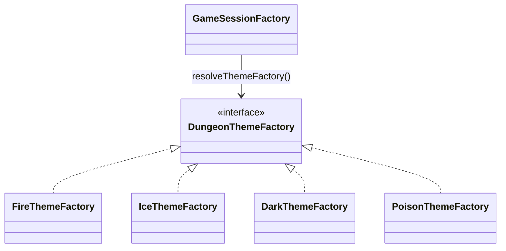

### Test de validacion
- `src/test/java/game/unit/creational/AbstractFactoryTest.java`

---

## 2) Builder

- Categoria: Creacional

### Problema que resuelve
Construir mazmorras con configuracion incremental y reproducible por seed,
evitando un constructor monolitico para estructuras complejas.

### Clases reales (rutas)
- `src/main/java/game/dungeon/builder/ProceduralDungeonGenerator.java`
- `src/main/java/game/dungeon/builder/DungeonBuilder.java`
- `src/main/java/game/dungeon/builder/ConcreteDungeonBuilder.java`
- `src/main/java/game/domain/exploration/Dungeon.java`
- `src/main/java/game/application/state/GameSessionFactory.java`

### Diagrama Mermaid
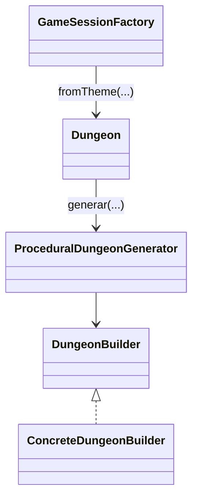

### Test de validacion
- `src/test/java/game/unit/creational/BuilderPatternTest.java`
- `src/test/java/game/unit/creational/ProceduralDungeonSeedDeterminismTest.java`

---

## 3) Factory Method

- Categoria: Creacional

### Problema que resuelve
Instanciar heroes y enemigos sin acoplar la capa de aplicacion a clases
concretas de personaje.

### Clases reales (rutas)
- `src/main/java/game/domain/personaje/factory/PersonajeFactory.java`
- `src/main/java/game/domain/personaje/factory/GuerreroFactory.java`
- `src/main/java/game/domain/personaje/factory/ArqueroFactory.java`
- `src/main/java/game/domain/personaje/factory/MagoFactory.java`
- `src/main/java/game/domain/personaje/factory/DragonFactory.java`
- `src/main/java/game/domain/personaje/factory/EnemigoBasicoFactory.java`
- `src/main/java/game/domain/personaje/factory/OrcoFactory.java`
- `src/main/java/game/application/state/GameSessionFactory.java`
- `src/main/java/game/state/domain/setup/SetupDomainState.java`

### Diagrama Mermaid
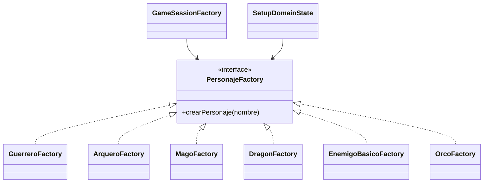

### Test de validacion
- `src/test/java/game/unit/creational/FactoryMethodTest.java`

---

## 4) Composite

- Categoria: Estructural

### Problema que resuelve
Representar inventario jerarquico (contenedores anidados) y operar de forma
uniforme sobre hojas y compuestos.

### Clases reales (rutas)
- `src/main/java/game/items/model/ItemComponent.java`
- `src/main/java/game/items/model/ContainerItem.java`
- `src/main/java/game/items/model/SimpleItem.java`
- `src/main/java/game/domain/inventory/Inventory.java`
- `src/main/java/game/application/usecase/UseItemUseCase.java`

### Diagrama Mermaid
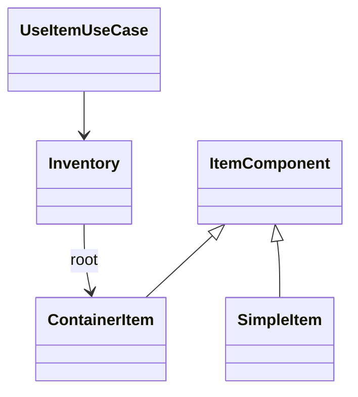

### Test de validacion
- `src/test/java/game/unit/structural/CompositePatternTest.java`
- `src/test/java/game/unit/application/UseItemUseCaseCompositeHierarchyTest.java`

---

## 5) Decorator

- Categoria: Estructural

### Problema que resuelve
Aplicar efectos de estado acumulables (poison, strength, guard, burn, stun)
sin multiplicar condicionales en el motor de combate.

### Clases reales (rutas)
- `src/main/java/game/effects/status/CharacterDecorator.java`
- `src/main/java/game/effects/status/PoisonEffect.java`
- `src/main/java/game/effects/status/StrengthEffect.java`
- `src/main/java/game/effects/status/GuardEffect.java`
- `src/main/java/game/effects/status/BurnEffect.java`
- `src/main/java/game/effects/status/StunEffect.java`
- `src/main/java/game/domain/combat/CombatStatusDecoratorPipeline.java`
- `src/main/java/game/domain/combat/Combat.java`

### Diagrama Mermaid
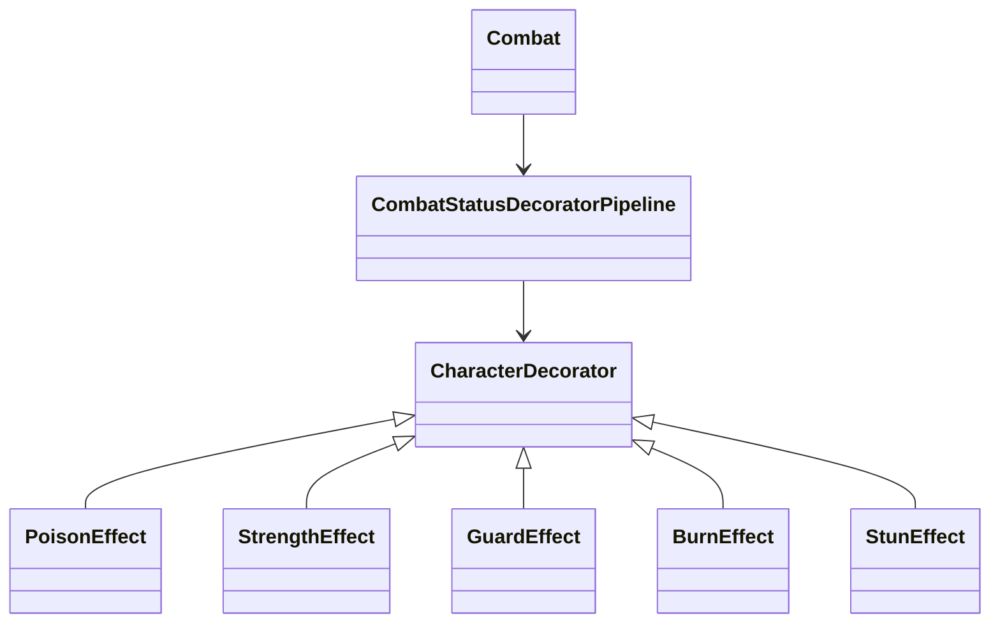

### Test de validacion
- `src/test/java/game/unit/structural/DecoratorPatternTest.java`
- `src/test/java/game/unit/domain/combat/CombatDecoratorIntegrationTest.java`

---

## 6) Facade

- Categoria: Estructural

### Problema que resuelve
Exponer una API simple para combate ocultando detalles del subsistema
(`MotorCombate`, logs, estadisticas y aplicacion de efectos).

### Clases reales (rutas)
- `src/main/java/game/patterns/combat/facade/CombatFacade.java`
- `src/main/java/game/combat/engine/MotorCombate.java`
- `src/main/java/game/combat/model/ResultadoAtaque.java`
- `src/main/java/game/effects/status/CharacterDecorator.java`

### Diagrama Mermaid
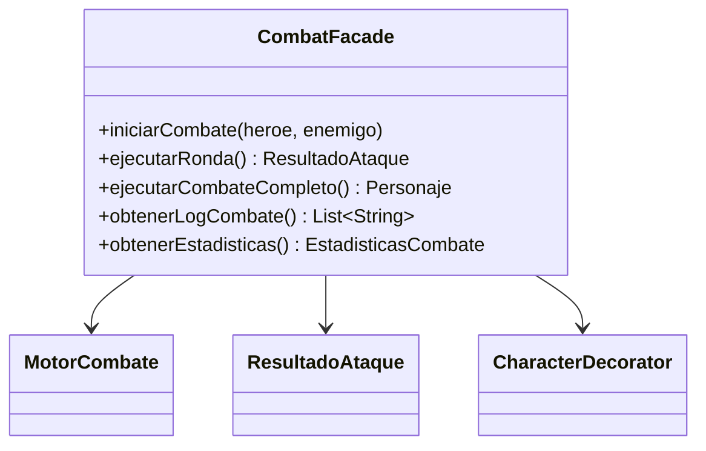

### Test de validacion
- `src/test/java/game/unit/structural/FacadePatternTest.java`

---

## 7) Command

- Categoria: Comportamiento

### Problema que resuelve
Encapsular acciones de juego en objetos independientes, con ejecucion,
deshacer, validacion previa y descripcion.

### Clases reales (rutas)
- `src/main/java/game/patterns/command/actions/Command.java`
- `src/main/java/game/patterns/command/actions/CommandInvoker.java`
- `src/main/java/game/patterns/command/actions/AttackCommand.java`
- `src/main/java/game/patterns/command/actions/DefendCommand.java`
- `src/main/java/game/patterns/command/actions/UseItemCommand.java`
- `src/main/java/game/patterns/command/actions/SkillCommand.java`
- `src/main/java/game/patterns/command/actions/LevelUpCommand.java`

### Diagrama Mermaid
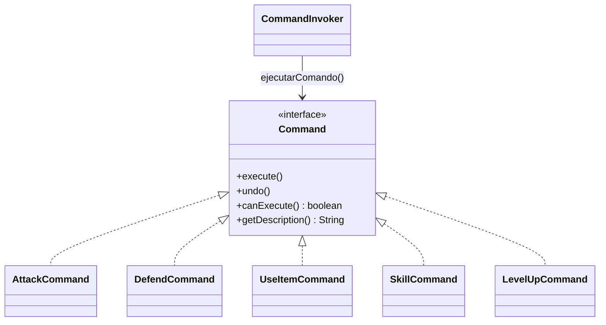

### Test de validacion
- `src/test/java/game/unit/behavioral/CommandPatternTest.java`

---

## 8) Observer

- Categoria: Comportamiento

### Problema que resuelve
Permitir que multiples consumidores reaccionen a eventos de juego sin acoplar
emisores con receptores concretos.

### Clases reales (rutas)
- `src/main/java/game/infrastructure/events/observer/EventManager.java`
- `src/main/java/game/infrastructure/events/observer/EventContractValidator.java`
- `src/main/java/game/infrastructure/events/observer/CombatLogger.java`
- `src/main/java/game/infrastructure/events/observer/StatisticsTracker.java`
- `src/main/java/game/infrastructure/events/observer/UINotifier.java`
- `src/main/java/game/application/ports/events/EventPublisher.java`
- `src/main/java/game/application/ports/events/GameObserver.java`
- `src/main/java/game/application/ports/events/GameEvent.java`
- `src/main/java/game/application/ports/events/EventType.java`

### Diagrama Mermaid
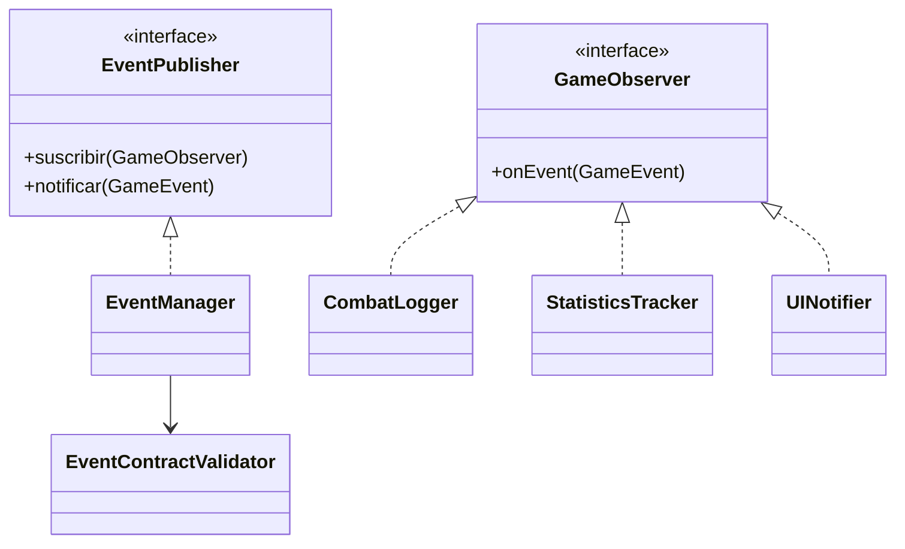

### Test de validacion
- `src/test/java/game/unit/behavioral/ObserverPatternTest.java`
- `src/test/java/game/integration/behavioral/EventObserversRuntimeIntegrationTest.java`

---

## 9) Strategy

- Categoria: Comportamiento

### Problema que resuelve
Variar comportamiento de combate (IA enemiga y estilo del jugador) sin
condicionales monoliticos.

### Clases reales (rutas)
- `src/main/java/game/ai/strategy/AIStrategy.java`
- `src/main/java/game/ai/strategy/AggressiveStrategy.java`
- `src/main/java/game/ai/strategy/DefensiveStrategy.java`
- `src/main/java/game/ai/strategy/RandomStrategy.java`
- `src/main/java/game/domain/combat/CombatSystem.java`
- `src/main/java/game/domain/combat/PlayerCombatStyle.java`
- `src/main/java/game/application/usecase/SetCombatStyleUseCase.java`
- `src/main/java/game/application/runtime/GameRuntime.java`

### Diagrama Mermaid
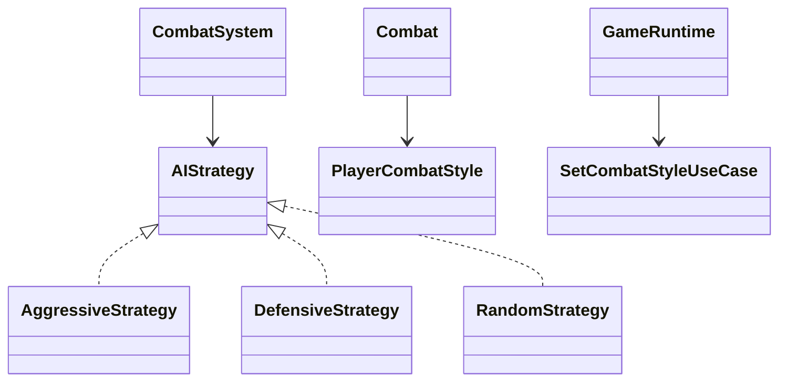

### Test de validacion
- `src/test/java/game/unit/behavioral/StrategyPatternTest.java`
- `src/test/java/game/unit/application/GameRuntimeExtendedCommandsTest.java`

---

## 10) State

- Categoria: Comportamiento

### Problema que resuelve
Gestionar transiciones de estado de forma explicita tanto en estados de demo
(`MenuState`, `CombatState`, etc.) como en estados runtime (`MenuRuntimeState`,
`AdventureRuntimeState`, `SetupRuntimeState`).

### Clases reales (rutas)
- `src/main/java/game/state/game/GameState.java`
- `src/main/java/game/state/game/GameStateContext.java`
- `src/main/java/game/state/game/MenuState.java`
- `src/main/java/game/state/game/CombatState.java`
- `src/main/java/game/state/game/ExplorationState.java`
- `src/main/java/game/state/game/InventoryState.java`
- `src/main/java/game/state/game/GameOverState.java`
- `src/main/java/game/state/game/runtime/MenuRuntimeState.java`
- `src/main/java/game/state/game/runtime/AdventureRuntimeState.java`
- `src/main/java/game/state/game/runtime/SetupRuntimeState.java`
- `src/main/java/game/application/state/GameFlowState.java`

### Diagrama Mermaid
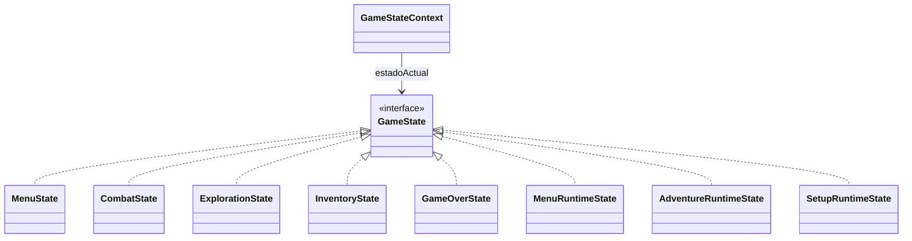

### Test de validacion
- `src/test/java/game/unit/behavioral/StatePatternTest.java`
- `src/test/java/game/integration/behavioral/GameRuntimeStateFlowIntegrationTest.java`

---

## 11) Memento

- Categoria: Comportamiento

### Problema que resuelve
Guardar y restaurar snapshot de sesion sin exponer estado mutable interno.

### Clases reales (rutas)
- `src/main/java/game/application/state/GameMemento.java`
- `src/main/java/game/infrastructure/persistence/memento/GameOriginator.java`
- `src/main/java/game/infrastructure/persistence/memento/GameCaretaker.java`
- `src/main/java/game/application/usecase/SaveGameUseCase.java`
- `src/main/java/game/application/usecase/LoadGameUseCase.java`
- `src/main/java/game/application/runtime/RuntimeSaveSlotManager.java`

### Diagrama Mermaid
```mermaid
classDiagram
    GameOriginator --> GameMemento : guardar()/restaurar()
    GameCaretaker --> GameMemento : guardarEnDisco()/cargarDesdeDisco()
    RuntimeSaveSlotManager --> SaveGameUseCase
    RuntimeSaveSlotManager --> LoadGameUseCase
    SaveGameUseCase --> GameCaretaker
    LoadGameUseCase --> GameCaretaker
```

### Test de validacion
- `src/test/java/game/unit/behavioral/MementoPatternTest.java`
- `src/test/java/game/integration/behavioral/StateMementoIntegrationTest.java`
