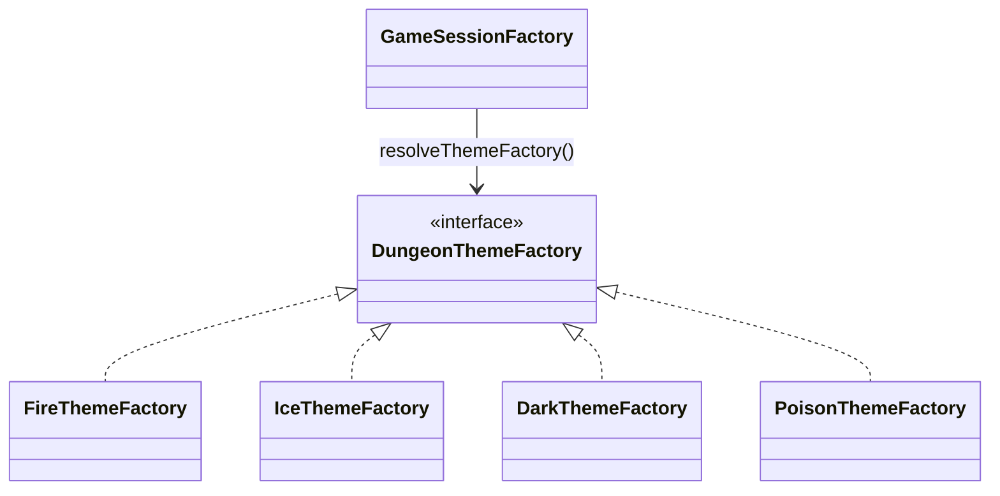
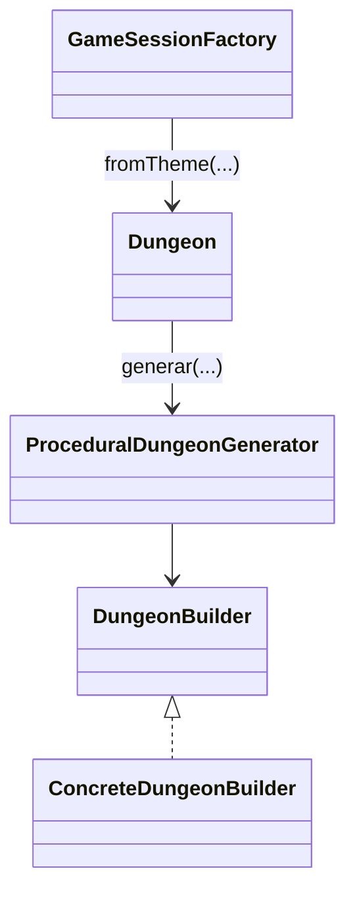
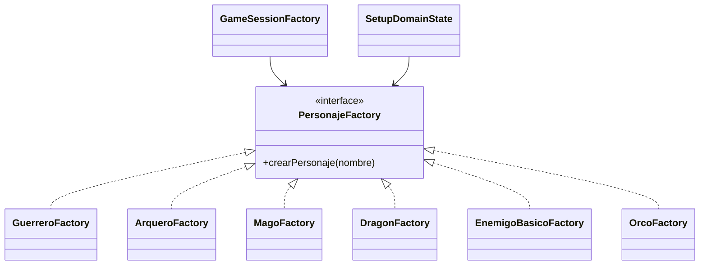
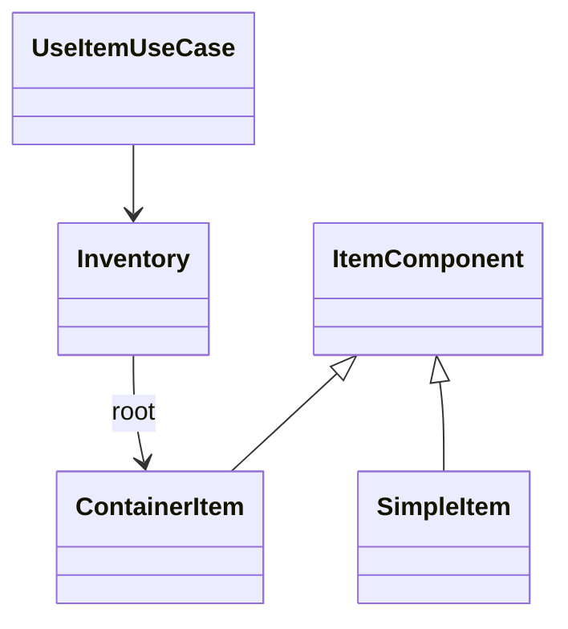
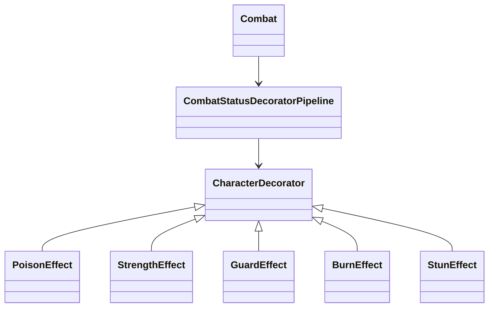
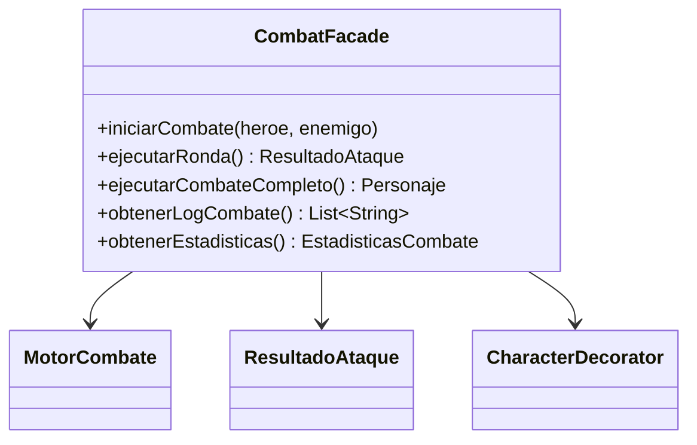
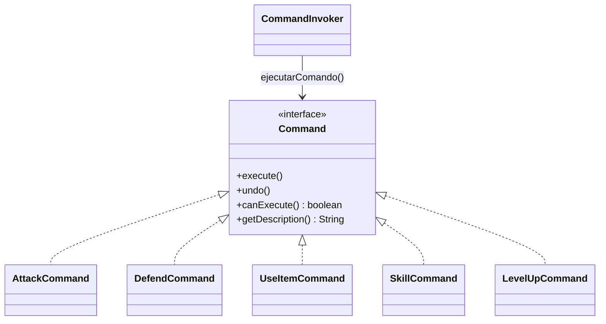
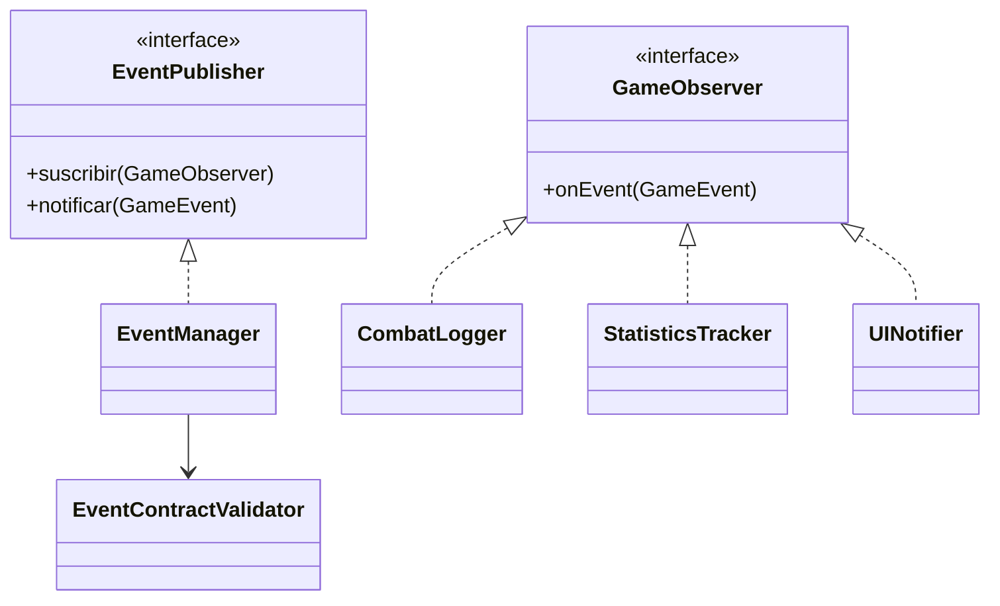
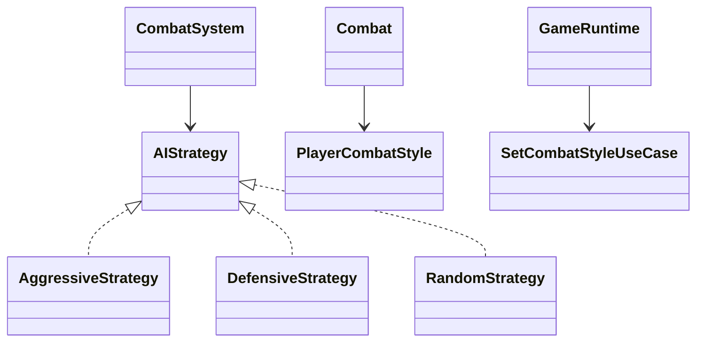
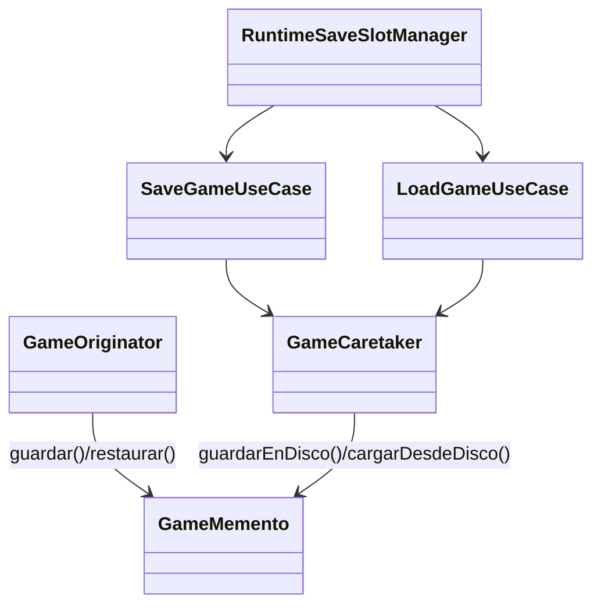

# Patrones Unificados - Dungeon Crawler

- Fecha de revision: 2026-04-13
- Rama auditada: Refactorizacion
- Estado: vigente

Documento consolidado con los 11 patrones implementados en el proyecto.
Cada seccion incluye: problema real, categoria, clases con rutas vigentes,
diagrama Mermaid y test de validacion.

## Matriz de patrones

| Patron | Categoria | Clase/paquete ancla | Test principal |
| --- | --- | --- | --- |
| Abstract Factory | Creacional | `game.dungeon.theme` | `AbstractFactoryTest` |
| Builder | Creacional | `game.dungeon.builder` | `BuilderPatternTest` |
| Factory Method | Creacional | `game.domain.personaje.factory` | `FactoryMethodTest` |
| Composite | Estructural | `game.items.model` | `CompositePatternTest` |
| Decorator | Estructural | `game.effects.status` | `DecoratorPatternTest` |
| Facade | Estructural | `game.patterns.combat.facade` | `FacadePatternTest` |
| Command | Comportamiento | `game.patterns.command.actions` | `CommandPatternTest` |
| Observer | Comportamiento | `game.infrastructure.events.observer` | `ObserverPatternTest` |
| Strategy | Comportamiento | `game.ai.strategy` | `StrategyPatternTest` |
| State | Comportamiento | `game.state.game` | `StatePatternTest` |
| Memento | Comportamiento | `game.infrastructure.persistence.memento` | `MementoPatternTest` |

---

## 1) Abstract Factory

- Categoria: Creacional

### Problema que resuelve
Crear familias coherentes de contenido por tema de mazmorra (fire, ice, dark,
poison) sin mezclar reglas entre temas.

### Clases reales (rutas)
- `src/main/java/game/dungeon/theme/DungeonThemeFactory.java`
- `src/main/java/game/dungeon/theme/FireThemeFactory.java`
- `src/main/java/game/dungeon/theme/IceThemeFactory.java`
- `src/main/java/game/dungeon/theme/DarkThemeFactory.java`
- `src/main/java/game/dungeon/theme/PoisonThemeFactory.java`
- `src/main/java/game/application/state/GameSessionFactory.java`

### Diagrama Mermaid

### Test de validacion
- `src/test/java/game/unit/creational/AbstractFactoryTest.java`

---

## 2) Builder

- Categoria: Creacional

### Problema que resuelve
Construir mazmorras con configuracion incremental y reproducible por seed,
evitando un constructor monolitico para estructuras complejas.

### Clases reales (rutas)
- `src/main/java/game/dungeon/builder/ProceduralDungeonGenerator.java`
- `src/main/java/game/dungeon/builder/DungeonBuilder.java`
- `src/main/java/game/dungeon/builder/ConcreteDungeonBuilder.java`
- `src/main/java/game/domain/exploration/Dungeon.java`
- `src/main/java/game/application/state/GameSessionFactory.java`

### Diagrama Mermaid

### Test de validacion
- `src/test/java/game/unit/creational/BuilderPatternTest.java`
- `src/test/java/game/unit/creational/ProceduralDungeonSeedDeterminismTest.java`

---

## 3) Factory Method

- Categoria: Creacional

### Problema que resuelve
Instanciar heroes y enemigos sin acoplar la capa de aplicacion a clases
concretas de personaje.

### Clases reales (rutas)
- `src/main/java/game/domain/personaje/factory/PersonajeFactory.java`
- `src/main/java/game/domain/personaje/factory/GuerreroFactory.java`
- `src/main/java/game/domain/personaje/factory/ArqueroFactory.java`
- `src/main/java/game/domain/personaje/factory/MagoFactory.java`
- `src/main/java/game/domain/personaje/factory/DragonFactory.java`
- `src/main/java/game/domain/personaje/factory/EnemigoBasicoFactory.java`
- `src/main/java/game/domain/personaje/factory/OrcoFactory.java`
- `src/main/java/game/application/state/GameSessionFactory.java`
- `src/main/java/game/state/domain/setup/SetupDomainState.java`

### Diagrama Mermaid

### Test de validacion
- `src/test/java/game/unit/creational/FactoryMethodTest.java`

---

## 4) Composite

- Categoria: Estructural

### Problema que resuelve
Representar inventario jerarquico (contenedores anidados) y operar de forma
uniforme sobre hojas y compuestos.

### Clases reales (rutas)
- `src/main/java/game/items/model/ItemComponent.java`
- `src/main/java/game/items/model/ContainerItem.java`
- `src/main/java/game/items/model/SimpleItem.java`
- `src/main/java/game/domain/inventory/Inventory.java`
- `src/main/java/game/application/usecase/UseItemUseCase.java`

### Diagrama Mermaid

### Test de validacion
- `src/test/java/game/unit/structural/CompositePatternTest.java`
- `src/test/java/game/unit/application/UseItemUseCaseCompositeHierarchyTest.java`

---

## 5) Decorator

- Categoria: Estructural

### Problema que resuelve
Aplicar efectos de estado acumulables (poison, strength, guard, burn, stun)
sin multiplicar condicionales en el motor de combate.

### Clases reales (rutas)
- `src/main/java/game/effects/status/CharacterDecorator.java`
- `src/main/java/game/effects/status/PoisonEffect.java`
- `src/main/java/game/effects/status/StrengthEffect.java`
- `src/main/java/game/effects/status/GuardEffect.java`
- `src/main/java/game/effects/status/BurnEffect.java`
- `src/main/java/game/effects/status/StunEffect.java`
- `src/main/java/game/domain/combat/CombatStatusDecoratorPipeline.java`
- `src/main/java/game/domain/combat/Combat.java`

### Diagrama Mermaid

### Test de validacion
- `src/test/java/game/unit/structural/DecoratorPatternTest.java`
- `src/test/java/game/unit/domain/combat/CombatDecoratorIntegrationTest.java`

---

## 6) Facade

- Categoria: Estructural

### Problema que resuelve
Exponer una API simple para combate ocultando detalles del subsistema
(`MotorCombate`, logs, estadisticas y aplicacion de efectos).

### Clases reales (rutas)
- `src/main/java/game/patterns/combat/facade/CombatFacade.java`
- `src/main/java/game/combat/engine/MotorCombate.java`
- `src/main/java/game/combat/model/ResultadoAtaque.java`
- `src/main/java/game/effects/status/CharacterDecorator.java`

### Diagrama Mermaid

### Test de validacion
- `src/test/java/game/unit/structural/FacadePatternTest.java`

---

## 7) Command

- Categoria: Comportamiento

### Problema que resuelve
Encapsular acciones de juego en objetos independientes, con ejecucion,
deshacer, validacion previa y descripcion.

### Clases reales (rutas)
- `src/main/java/game/patterns/command/actions/Command.java`
- `src/main/java/game/patterns/command/actions/CommandInvoker.java`
- `src/main/java/game/patterns/command/actions/AttackCommand.java`
- `src/main/java/game/patterns/command/actions/DefendCommand.java`
- `src/main/java/game/patterns/command/actions/UseItemCommand.java`
- `src/main/java/game/patterns/command/actions/SkillCommand.java`
- `src/main/java/game/patterns/command/actions/LevelUpCommand.java`

### Diagrama Mermaid

### Test de validacion
- `src/test/java/game/unit/behavioral/CommandPatternTest.java`

---

## 8) Observer

- Categoria: Comportamiento

### Problema que resuelve
Permitir que multiples consumidores reaccionen a eventos de juego sin acoplar
emisores con receptores concretos.

### Clases reales (rutas)
- `src/main/java/game/infrastructure/events/observer/EventManager.java`
- `src/main/java/game/infrastructure/events/observer/EventContractValidator.java`
- `src/main/java/game/infrastructure/events/observer/CombatLogger.java`
- `src/main/java/game/infrastructure/events/observer/StatisticsTracker.java`
- `src/main/java/game/infrastructure/events/observer/UINotifier.java`
- `src/main/java/game/application/ports/events/EventPublisher.java`
- `src/main/java/game/application/ports/events/GameObserver.java`
- `src/main/java/game/application/ports/events/GameEvent.java`
- `src/main/java/game/application/ports/events/EventType.java`

### Diagrama Mermaid

### Test de validacion
- `src/test/java/game/unit/behavioral/ObserverPatternTest.java`
- `src/test/java/game/integration/behavioral/EventObserversRuntimeIntegrationTest.java`

---

## 9) Strategy

- Categoria: Comportamiento

### Problema que resuelve
Variar comportamiento de combate (IA enemiga y estilo del jugador) sin
condicionales monoliticos.

### Clases reales (rutas)
- `src/main/java/game/ai/strategy/AIStrategy.java`
- `src/main/java/game/ai/strategy/AggressiveStrategy.java`
- `src/main/java/game/ai/strategy/DefensiveStrategy.java`
- `src/main/java/game/ai/strategy/RandomStrategy.java`
- `src/main/java/game/domain/combat/CombatSystem.java`
- `src/main/java/game/domain/combat/PlayerCombatStyle.java`
- `src/main/java/game/application/usecase/SetCombatStyleUseCase.java`
- `src/main/java/game/application/runtime/GameRuntime.java`

### Diagrama Mermaid

### Test de validacion
- `src/test/java/game/unit/behavioral/StrategyPatternTest.java`
- `src/test/java/game/unit/application/GameRuntimeExtendedCommandsTest.java`

---

## 10) State

- Categoria: Comportamiento

### Problema que resuelve
Gestionar transiciones de estado de forma explicita tanto en estados de demo
(`MenuState`, `CombatState`, etc.) como en estados runtime (`MenuRuntimeState`,
`AdventureRuntimeState`, `SetupRuntimeState`).

### Clases reales (rutas)
- `src/main/java/game/state/game/GameState.java`
- `src/main/java/game/state/game/GameStateContext.java`
- `src/main/java/game/state/game/MenuState.java`
- `src/main/java/game/state/game/CombatState.java`
- `src/main/java/game/state/game/ExplorationState.java`
- `src/main/java/game/state/game/InventoryState.java`
- `src/main/java/game/state/game/GameOverState.java`
- `src/main/java/game/state/game/runtime/MenuRuntimeState.java`
- `src/main/java/game/state/game/runtime/AdventureRuntimeState.java`
- `src/main/java/game/state/game/runtime/SetupRuntimeState.java`
- `src/main/java/game/application/state/GameFlowState.java`

### Diagrama Mermaid

### Test de validacion
- `src/test/java/game/unit/behavioral/StatePatternTest.java`
- `src/test/java/game/integration/behavioral/GameRuntimeStateFlowIntegrationTest.java`

---

## 11) Memento

- Categoria: Comportamiento

### Problema que resuelve
Guardar y restaurar snapshot de sesion sin exponer estado mutable interno.

### Clases reales (rutas)
- `src/main/java/game/application/state/GameMemento.java`
- `src/main/java/game/infrastructure/persistence/memento/GameOriginator.java`
- `src/main/java/game/infrastructure/persistence/memento/GameCaretaker.java`
- `src/main/java/game/application/usecase/SaveGameUseCase.java`
- `src/main/java/game/application/usecase/LoadGameUseCase.java`
- `src/main/java/game/application/runtime/RuntimeSaveSlotManager.java`

### Diagrama Mermaid

### Test de validacion
- `src/test/java/game/unit/behavioral/MementoPatternTest.java`
- `src/test/java/game/integration/behavioral/StateMementoIntegrationTest.java`
