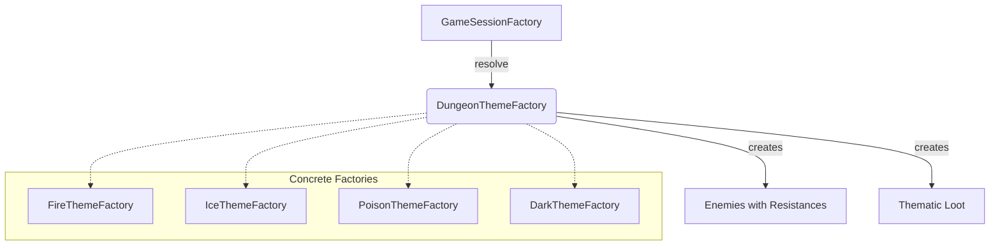

# Patrón Abstract Factory en Runtime

- Fecha de actualización: 2026-04-13
- Estado: ✅ Remediado

## Problema real que resuelve
El juego necesita crear familias coherentes de contenido por tema de mazmorra (fuego, hielo, oscuridad, veneno) sin mezclar reglas de cada tema. La remediación ha eliminado rutas legacy paralelas, unificado la creación en el flujo productivo y garantizado contratos de propiedades elementales.

## Clases Principales (Rutas Reales)
- `game.dungeon.theme.DungeonThemeFactory`: Interfaz de la factoría abstracta.
- `game.dungeon.theme.FireThemeFactory`: Crea contenido ígneo con resistencias al fuego.
- `game.dungeon.theme.IceThemeFactory`: Crea contenido glacial con resistencias al hielo.
- `game.dungeon.theme.DarkThemeFactory`: Crea contenido umbrío con resistencias a la oscuridad.
- `game.dungeon.theme.PoisonThemeFactory`: Crea contenido tóxico con resistencias al veneno.
- `game.application.state.GameSessionFactory`: Orquestador que mapea el selector de tema a la factoría concreta.

## Contratos de Productos por Tema
Cada factoría garantiza que los productos creados cumplen con las propiedades del tema:

| Tema | Enemigo (Resistencia Base) | Loot Temático (Ejemplo) |
|------|---------------------------|-------------------------|
| **Fuego** | Fire +20 (Básico), +100 (Jefe) | Espada Flamígera |
| **Hielo** | Ice +20 (Básico), +100 (Jefe) | Báculo del Invierno |
| **Veneno** | Poison +20 (Básico), +100 (Jefe) | Daga del Asesino |
| **Oscuridad** | Dark +20 (Básico), +100 (Jefe) | Armadura de las Sombras |

## Conexión con Runtime Productivo
- Se ha eliminado el paquete legacy `game.state.domain` que contenía implementaciones paralelas de estados de juego.
- `GameSessionFactory` es ahora la única fuente de verdad para la resolución de temas en el inicio de partida.
- El mapeo `tema -> fábrica` se valida en tiempo de ejecución mediante tests de integración que verifican las propiedades de los enemigos generados.

## Diagrama de Relaciones

## Validación de Integración
- **Tests de Contrato**: `AbstractFactoryTest.testContratoResistenciasPorTema` verifica que cada factoría inyecte las resistencias correctas.
- **Tests de Mapeo**: `AbstractFactoryTest.testMapeoTemaRuntimeEnSessionFactory` garantiza que el selector de `GameSessionFactory` funciona para todos los temas.
