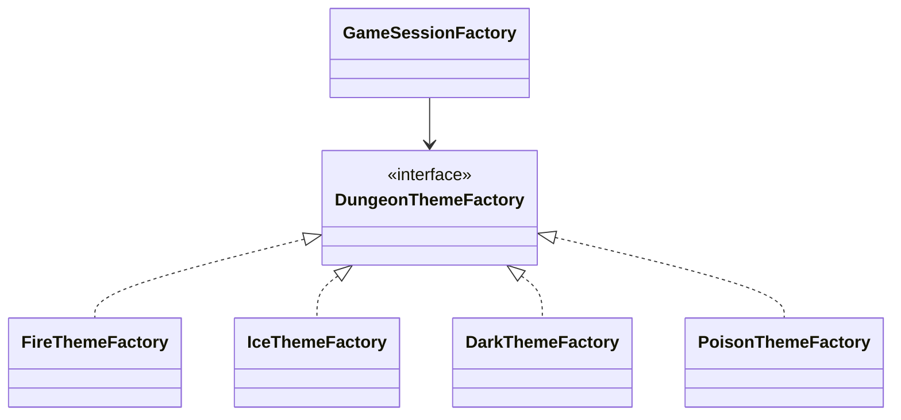

# Patron Abstract Factory en Runtime

- Fecha de creacion: 2026-04-09
- Rama auditada: master
- Estado: vigente

## Problema real que resuelve
El juego necesita crear familias coherentes de contenido por tema de mazmorra
(fuego, hielo, oscuridad, veneno) sin mezclar reglas de cada tema.

## Clases principales (rutas reales)
- `src/main/java/game/dungeon/theme/DungeonThemeFactory.java`
- `src/main/java/game/dungeon/theme/FireThemeFactory.java`
- `src/main/java/game/dungeon/theme/IceThemeFactory.java`
- `src/main/java/game/dungeon/theme/DarkThemeFactory.java`
- `src/main/java/game/dungeon/theme/PoisonThemeFactory.java`
- `src/main/java/game/application/state/GameSessionFactory.java`

## Conexion con runtime productivo
- `GameSessionFactory` resuelve la fabrica de tema y la pasa a
  `Dungeon.fromTheme(...)`.
- La familia de objetos de cada tema se aplica de forma consistente en
  generacion procedural y progresion.

## Test de validacion en runtime real
- `src/test/java/game/unit/creational/AbstractFactoryTest.java`

## Diagrama minimo

