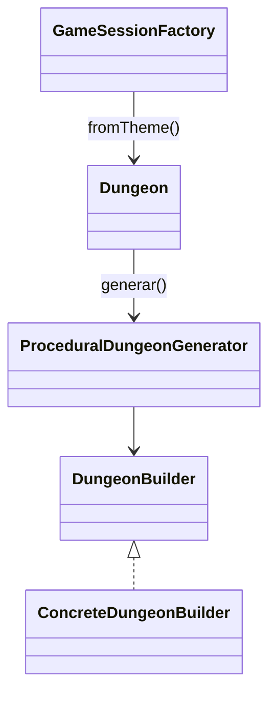

# Patron Builder (Procedural) en Runtime

- Fecha de creacion: 2026-04-04
- Rama auditada: Flujo-de-mazmorra
- Estado: vigente

## Problema real que resuelve
El juego requiere construir mazmorras reproducibles por semilla y variables por tema sin acoplar la construccion a una sola configuracion fija.

## Clases principales (rutas reales)
- `src/main/java/game/dungeon/builder/ProceduralDungeonGenerator.java`
- `src/main/java/game/dungeon/builder/DungeonBuilder.java`
- `src/main/java/game/dungeon/builder/ConcreteDungeonBuilder.java`
- `src/main/java/game/domain/exploration/Dungeon.java` (`fromTheme`)
- `src/main/java/game/application/state/GameSessionFactory.java`

## Conexion con runtime productivo
- `GameSessionFactory` crea sesiones usando `Dungeon.fromTheme(...)`.
- `Dungeon.fromTheme` invoca `ProceduralDungeonGenerator.generar(...)` con builder y semilla.
- La semilla persiste para restaurar estructura al cargar.

## Test de validacion en runtime real
- `src/test/java/game/unit/creational/ProceduralDungeonSeedDeterminismTest.java`

## Diagrama minimo

