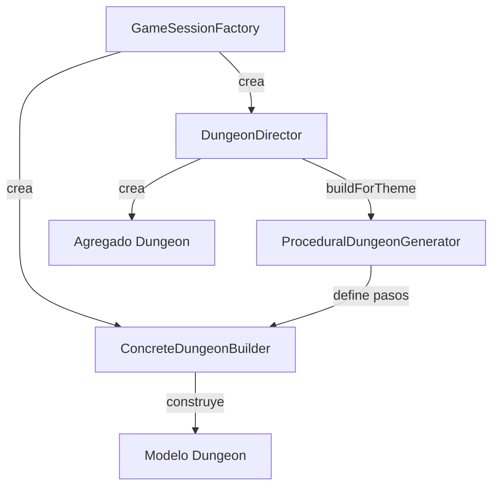

# Patrón Builder (Procedural) en Runtime

- Fecha de actualización: 2026-04-13
- Estado: ✅ Remediado

## Problema real que resuelve
El juego requiere construir mazmorras reproducibles por semilla y variables por tema sin acoplar la construcción a una sola configuración fija. La remediación ha centralizado la orquestación en el `DungeonDirector`, desacoplando el agregado `Dungeon` de la implementación concreta del builder.

## Clases Principales (Rutas Reales)
- `game.dungeon.builder.DungeonDirector`: Orquestador de la construcción. Define métodos para mazmorras predefinidas y el método productivo `buildForTheme`.
- `game.dungeon.builder.DungeonBuilder`: Interfaz que define los pasos de construcción (nombre, tema, salas, jefe).
- `game.dungeon.builder.ConcreteDungeonBuilder`: Implementación que maneja el estado interno y construye el modelo de datos.
- `game.dungeon.builder.ProceduralDungeonGenerator`: Algoritmo de generación que consume un `DungeonBuilder`.
- `game.domain.exploration.Dungeon`: Agregado de dominio que ahora utiliza el Director para su instanciación factory.
- `game.application.state.GameSessionFactory`: Punto de entrada que utiliza el Director para iniciar nuevas partidas.

## Conexión con Runtime Productivo
- `GameSessionFactory` utiliza `DungeonDirector` con un `ConcreteDungeonBuilder` para generar la mazmorra inicial.
- El método `buildForTheme(theme, seed)` en `DungeonDirector` encapsula la lógica de generación procedural, asegurando que el proceso sea reproducible y mantenible.
- Se ha eliminado la dependencia directa entre el dominio y la clase concreta del builder, cumpliendo con el principio de inversión de dependencias.

## Diagrama de Secuencia Productivo

## Validación de Integración
- **Tests de Equivalencia**: Se ha validado que construir vía `DungeonDirector` o `Dungeon.fromTheme` produce resultados idénticos bajo la misma semilla.
- **Tests de Determinismo**: `BuilderPatternTest.testDeterminismoSemilla` confirma que la estructura de salas y dificultad es constante para una semilla dada.
- **Tests de Perfil**: Se valida que los métodos del Director (`construirMazmorraBasica` vs `construirMazmorraOscura`) aplican gradientes de dificultad correctos en el modelo.
