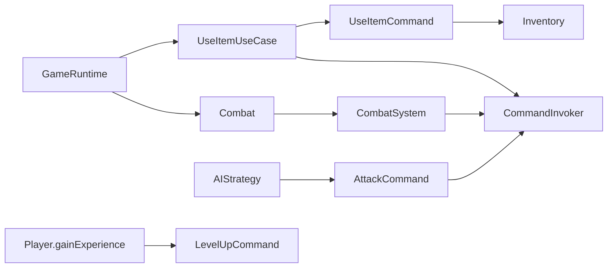

# Patron Command en runtime productivo

- Fecha de revision: 2026-04-13
- Rama: Refactorizacion
- Estado: remediado e integrado

## Problema real que resuelve
Command unifica la ejecucion de acciones de combate/inventario para evitar rutas paralelas
de daño o consumo de items, y para dejar historial trazable en `CommandInvoker`.

## Clases reales en flujo productivo
- `src/main/java/game/patterns/command/actions/Command.java`
- `src/main/java/game/patterns/command/actions/CommandInvoker.java`
- `src/main/java/game/patterns/command/actions/AttackCommand.java`
- `src/main/java/game/patterns/command/actions/DefendCommand.java`
- `src/main/java/game/patterns/command/actions/SkillCommand.java`
- `src/main/java/game/patterns/command/actions/UseItemCommand.java`
- `src/main/java/game/patterns/command/actions/LevelUpCommand.java`
- `src/main/java/game/domain/combat/CombatSystem.java`
- `src/main/java/game/domain/combat/Combat.java`
- `src/main/java/game/application/usecase/UseItemUseCase.java`
- `src/main/java/game/application/runtime/GameRuntime.java`

## Cadena real de invocacion
1. `GameRuntime.handleCommand("attack"|"defend"|"useItem")` delega en use cases.
2. `Combat` y `CombatSystem` crean comandos concretos.
3. `CommandInvoker.execute(...)` valida `canExecute()`, ejecuta y registra historial.
4. El daño/consumo sale del comando ejecutado (`AttackCommand`/`UseItemCommand`).

Ruta de ataque IA:
`AIStrategy -> AttackCommand -> CommandInvoker.execute() -> daño real`

## Integraciones clave
- `CombatSystem.playerAttack(...)` ejecuta `AttackCommand` via invoker y retorna `getDanioAplicado()`.
- `CombatSystem.enemyTurn(...)` ejecuta `AttackCommand` enemigo via invoker (sin ruta paralela).
- `UseItemUseCase.execute(...)` crea `UseItemCommand` y lo ejecuta via `session.combat().executeCommand(...)`.
- `UseItemCommand.execute()` consume item con `Inventory.useItem(itemId)` y aplica efectos en combate.
- `Player.gainExperience(...)` usa `LevelUpCommand` para encapsular progresion de XP/nivel.

## Reversibilidad
Reversibilidad parcial:
- `AttackCommand`: no soporta undo por diseño.
- `DefendCommand`: soporta undo.
- `SkillCommand`: soporta undo.
- `UseItemCommand`: no soporta undo por seguridad de estado.

## Tests relevantes
- `src/test/java/game/unit/behavioral/CommandPatternTest.java`
    - undo de `AttackCommand` reporta no reversibilidad
    - `undoLastN(...)` reduce historial activo
    - `UseItemCommand` en combate aumenta HP y consume item
- `src/test/java/game/unit/domain/combat/CombatSystemTest.java`
    - `playerAttack(...)` registra `AttackCommand` en historial
    - turno enemigo agresivo registra `AttackCommand` en historial
- `src/test/java/game/integration/behavioral/BehavioralPatternsIntegrationTest.java`
    - ataques integrados via comando sin doble daño manual
- `src/test/java/game/unit/application/UseItemUseCaseCompositeHierarchyTest.java`
    - flujo use item consume item anidado por índice

## Diagrama de flujo

