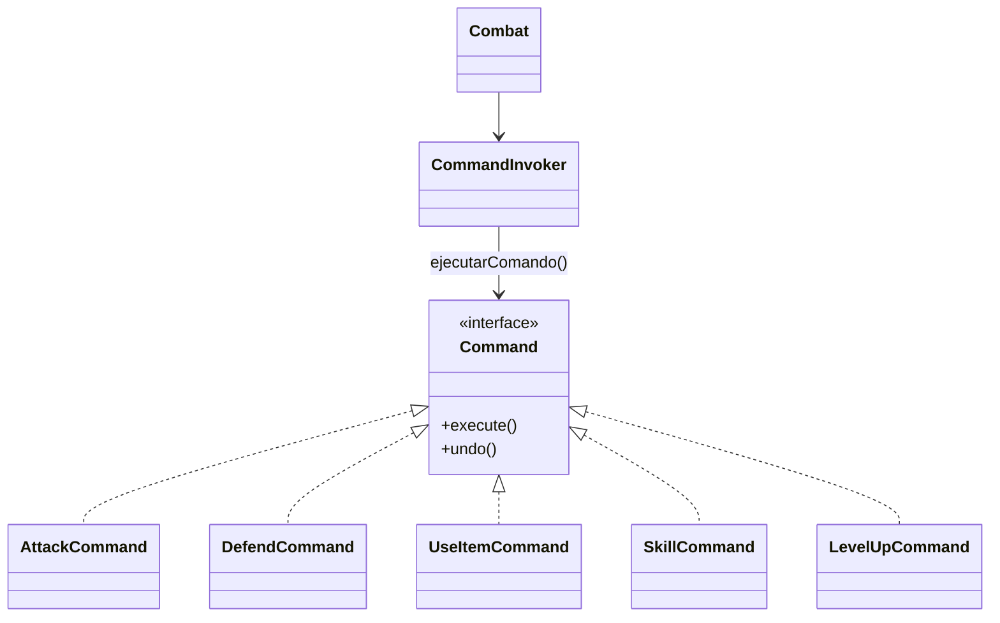

# Patron Command en Runtime

- Fecha de creacion: 2026-04-09
- Rama auditada: master
- Estado: vigente

## Problema real que resuelve
Las acciones de combate y progresion deben ejecutarse de forma uniforme,
registrable y reversible sin acoplar al invocador con cada accion concreta.

## Clases principales (rutas reales)
- `src/main/java/game/command/actions/Command.java`
- `src/main/java/game/command/actions/CommandInvoker.java`
- `src/main/java/game/command/actions/AttackCommand.java`
- `src/main/java/game/command/actions/DefendCommand.java`
- `src/main/java/game/command/actions/UseItemCommand.java`
- `src/main/java/game/command/actions/SkillCommand.java`
- `src/main/java/game/command/actions/LevelUpCommand.java`
- `src/main/java/game/domain/combat/Combat.java`

## Conexion con runtime productivo
- `Combat` usa `CommandInvoker` para ejecutar acciones del turno.
- El invocador mantiene historial y soporte de undo, desacoplando emisor y
  receptor de la accion.

## Test de validacion en runtime real
- `src/test/java/game/unit/behavioral/CommandPatternTest.java`

## Diagrama minimo

