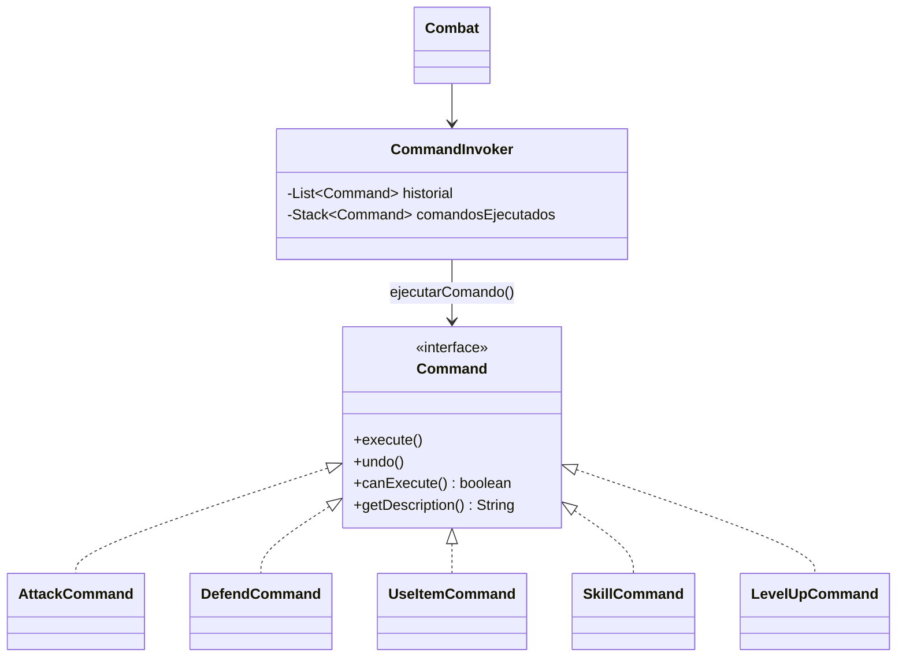

# Patron Command en Runtime

- Fecha de revision: 2026-04-13
- Estado: vigente

## Problema real que resuelve
Las acciones de combate y progresion deben ejecutarse de forma uniforme,
registrable y reversible sin acoplar al invocador con cada accion concreta.

## Clases principales (rutas reales)
- `src/main/java/game/patterns/command/actions/Command.java`
- `src/main/java/game/patterns/command/actions/CommandInvoker.java`
- `src/main/java/game/patterns/command/actions/AttackCommand.java`
- `src/main/java/game/patterns/command/actions/DefendCommand.java`
- `src/main/java/game/patterns/command/actions/UseItemCommand.java`
- `src/main/java/game/patterns/command/actions/SkillCommand.java`
- `src/main/java/game/patterns/command/actions/LevelUpCommand.java`
- `src/main/java/game/domain/combat/Combat.java`

## Contrato real de Command
- `execute()`
- `undo()`
- `canExecute()`
- `getDescription()`

## Conexion con runtime productivo
- `Combat` y `CombatSystem` usan comandos concretos para ejecutar acciones de turno.
- `CommandInvoker` valida `canExecute()` antes de ejecutar, registra historial y soporta undo.
- El paquete productivo vigente es `game.patterns.command.actions`.

## Test de validacion en runtime real
- `src/test/java/game/unit/behavioral/CommandPatternTest.java`

## Diagrama

