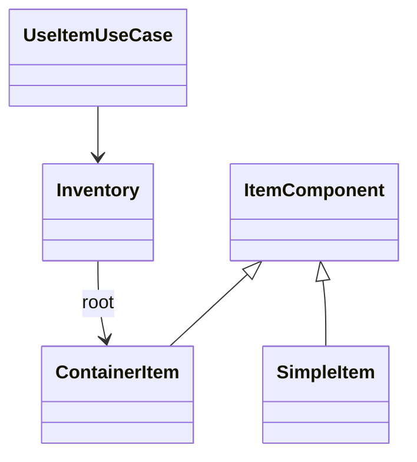

# Patron Composite en Runtime

- Fecha de creacion: 2026-04-04
- Rama auditada: Flujo-de-mazmorra
- Estado: vigente

## Problema real que resuelve
El inventario necesita contener estructuras anidadas (contenedores dentro de contenedores) y permitir operaciones uniformes de seleccion/uso.

## Clases principales (rutas reales)
- `src/main/java/game/items/model/ItemComponent.java`
- `src/main/java/game/items/model/ContainerItem.java`
- `src/main/java/game/items/model/SimpleItem.java`
- `src/main/java/game/domain/inventory/Inventory.java`
- `src/main/java/game/application/usecase/UseItemUseCase.java`

## Conexion con runtime productivo
- `Inventory` recorre el arbol Composite para exponer seleccion plana en UI.
- `UseItemUseCase` consume items reales desde la jerarquia (incluyendo items anidados).
- El runtime usa estos datos para comandos `useItem` y `consumeSelectedItem`.

## Test de validacion en runtime real
- `src/test/java/game/unit/application/UseItemUseCaseCompositeHierarchyTest.java`

## Diagrama minimo

