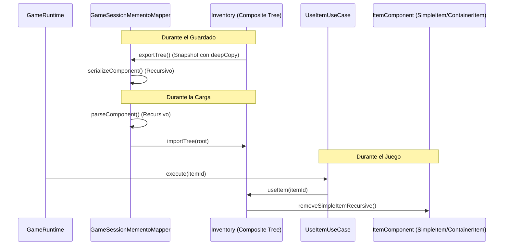
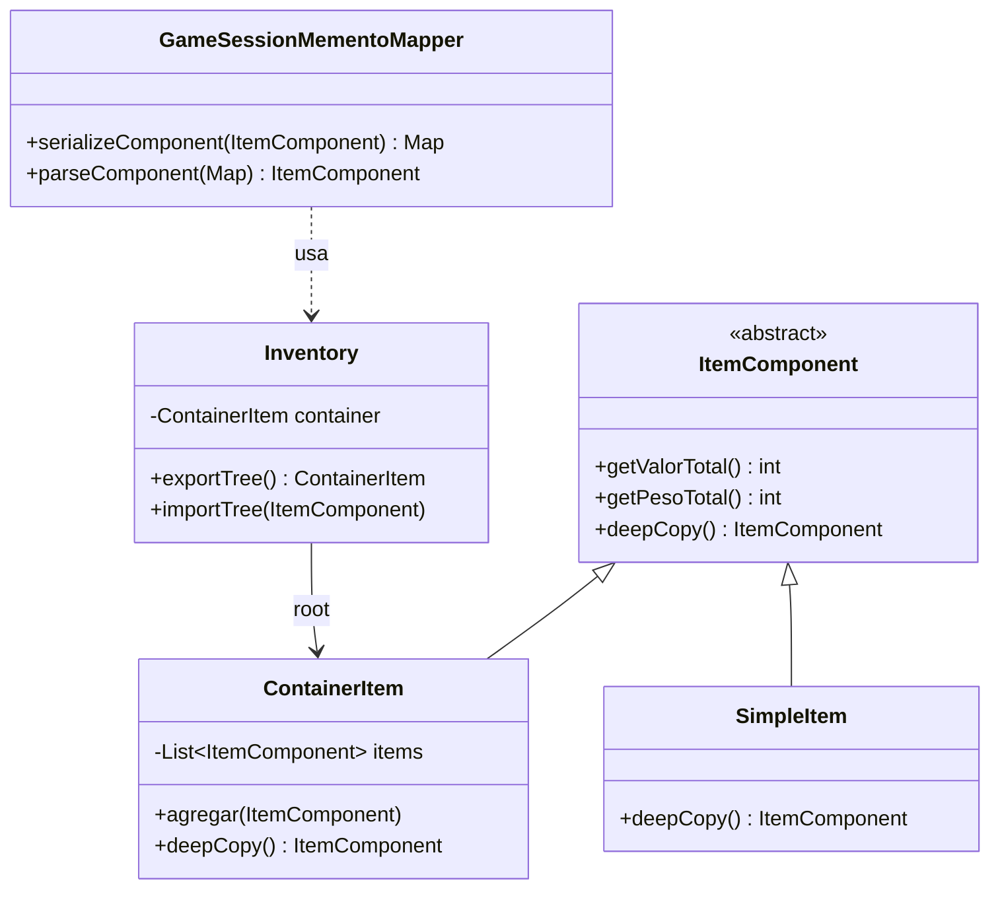

# Patrón Composite en Runtime

- Fecha de actualización: 2026-04-13
- Rama auditada: master/remediation-composite
- Estado: ✅ Remediado

## Problema real que resuelve
El inventario del jugador necesita manejar estructuras jerárquicas (contenedores dentro de contenedores, como bolsas dentro de mochilas) permitiendo operaciones uniformes tanto sobre ítems individuales como sobre colecciones. El reto principal era la persistencia, ya que los sistemas tradicionales aplanaban la estructura perdiendo el anidamiento.

## Estructura de Integración Productiva

## Clases Principales (Rutas Actualizadas)
- `game.items.model.ItemComponent`: Clase base que define la interfaz uniforme.
- `game.items.model.ContainerItem`: El Composite que puede contener otros `ItemComponent`.
- `game.items.model.SimpleItem`: El Leaf que representa ítems individuales.
- `game.domain.inventory.Inventory`: Agregado que coordina el árbol Composite y la selección para la UI.
- `game.domain.inventory.Item`: Wrapper de dominio usado para exponer datos a la capa de aplicación/UI.
- `game.application.usecase.UseItemUseCase`: Caso de uso que interactúa con la jerarquía completa.
- `game.application.state.GameSessionMementoMapper`: Orquestador de la serialización jerárquica (reemplaza la serialización plana previa).

## Métodos Reales de Inventory
- `simpleItems()`: Devuelve una lista aplanada para visualización en UI sin perder la integridad del árbol.
- `collectSimpleItems(parent, sink)`: Método recursivo privado para recolectar hojas.
- `removeSimpleItemRecursive(parent, target)`: Elimina un componente buscando en toda la profundidad de la jerarquía.
- `replaceItems(list, index)`: (Legacy) Mantenido para compatibilidad de carga simple.
- `exportTree()`: Genera una **copia profunda** (`deepCopy`) del árbol raíz para persistencia segura.
- `importTree(root, index)`: Sustituye toda la jerarquía de ítems actual reconstruyendo el árbol Composite.

## Validación de Integración
- **Tests de Persistencia de Jerarquía**: `CompositeIntegrationTest` valida que al guardar una "Mochila" con una "Bolsa Secreta" anidada, al cargar la partida la estructura se mantiene intacta (no se aplana).
- **Tests de Corrupción**: Verificación de que el sistema detecta y rechaza datos de inventario dañados o en formatos binarios inválidos.
- **Tests Unitarios**: `InventoryTest` valida la clonación profunda y la integridad del árbol tras operaciones de entrada/salida.

## Diagrama de Clases

