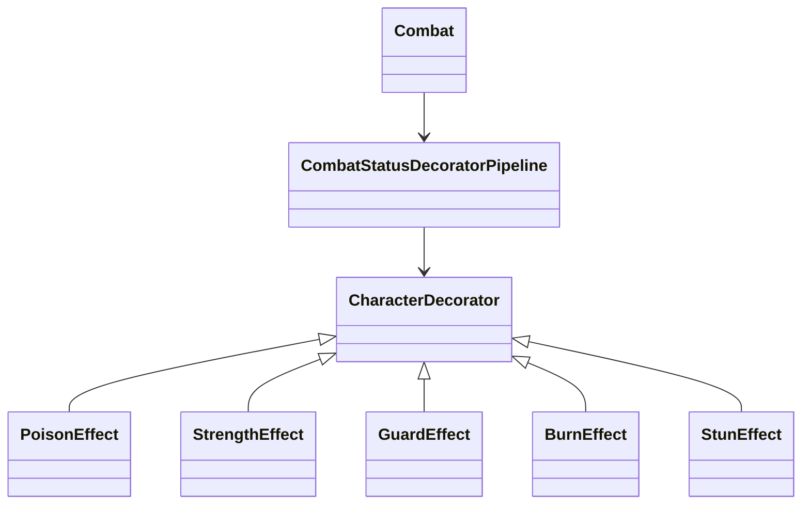

# Patron Decorator en Runtime

- Fecha de creacion: 2026-04-04
- Rama auditada: Flujo-de-mazmorra
- Estado: vigente

## Problema real que resuelve
Combate requiere aplicar efectos de estado acumulables (veneno, buff ofensivo, mitigacion) sin multiplicar ramas condicionales en la logica central.

## Clases principales (rutas reales)
- `src/main/java/game/domain/combat/CombatStatusDecoratorPipeline.java`
- `src/main/java/game/effects/status/CharacterDecorator.java`
- `src/main/java/game/effects/status/PoisonEffect.java`
- `src/main/java/game/effects/status/StrengthEffect.java`
- `src/main/java/game/effects/status/GuardEffect.java`
- `src/main/java/game/effects/status/BurnEffect.java`
- `src/main/java/game/effects/status/StunEffect.java`
- `src/main/java/game/domain/combat/Combat.java`

## Conexion con runtime productivo
- `Combat` invoca `CombatStatusDecoratorPipeline` en ataque/mitigacion.
- El pipeline materializa decoradores concretos y devuelve impacto efectivo en stats.
- El flujo es parte del combate real, no de demos.

## Test de validacion en runtime real
- `src/test/java/game/unit/domain/combat/CombatDecoratorIntegrationTest.java`
- `src/test/java/game/unit/structural/DecoratorPatternTest.java`

## Diagrama minimo

