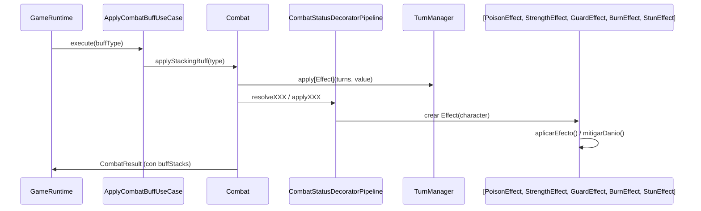

# Patrón Decorator en Runtime

- Fecha de actualización: 2026-04-13
- Rama auditada: master/remediation-decorator
- Estado: ✅ Remediado

## Problema real que resuelve
El combate requiere aplicar efectos de estado acumulables (veneno, quemadura, aturdimiento, buff ofensivo, mitigación) sin multiplicar ramas condicionales en la lógica central. El patrón Decorator permite añadir estas responsabilidades dinámicamente al personaje manteniendo el cálculo de stats desacoplado.

## Estructura de Integración Productiva

## Clases Principales (Rutas Actualizadas)
- `game.domain.combat.CombatStatusDecoratorPipeline`: Orquestador que materializa los decoradores.
- `game.effects.status.CharacterDecorator`: Base del patrón para decorar `Personaje`.
- `game.effects.status.PoisonEffect`: Daño por veneno al inicio de turno.
- `game.effects.status.BurnEffect`: Daño por fuego (Quemadura) al inicio de turno.
- `game.effects.status.StunEffect`: Aturdimiento que provoca pérdida de turno.
- `game.effects.status.StrengthEffect`: Multiplicador de daño ofensivo.
- `game.effects.status.GuardEffect`: Mitigación de daño recibido.
- `game.domain.combat.Combat`: Agregado que coordina la aplicación de buffs y el flujo de combate.

## Métodos Críticos del Flujo Real
- `applyStackingBuff(type)`: Punto de entrada para que el jugador aplique potenciadores o para procesar efectos externos.
- `startPlayerTurn()`: Procesa efectos de inicio de turno (Veneno, Quemadura) y verifica estados de control (Aturdimiento).
- `applyOutgoingModifiers(baseDamage)`: Utiliza decoradores para calcular el daño final saliente.
- `applyIncomingMitigation(enemyTurn)`: Utiliza decoradores para calcular la reducción de daño entrante.

## Política de Stacking
- **Límite Máximo**: Cada efecto tiene un límite de **3 acumulaciones**. Intentar superar este límite resulta en un rechazo de la acción con una advertencia al usuario.
- **Consumo**: Los buffs de potencia y guardia se consumen tras su uso (ataque realizado o daño mitigado respectivamente), mientras que los ticks de daño permanecen según su duración en turnos.

## Conexión con Sistema de Eventos
Cada vez que se aplica un buff exitosamente a través de `ApplyCombatBuffUseCase`, se emite un evento `EFECTO_APLICADO` al `EventPublisher` con los siguientes datos:
- `personaje`: Nombre del héroe afectado.
- `efecto`: Tipo de efecto (poder, guardia, quemadura, aturdimiento).
- `acumulaciones`: Nivel actual de stack del efecto.

## Validación de Integración
- **Tests de Integración**: `CombatDecoratorIntegrationTest` valida el flujo completo desde el agregado `Combat`, asegurando que los ticks de daño y mitigación afecten realmente al HP del jugador.
- **Tests de Casos de Uso**: `ApplyCombatBuffUseCaseTest` valida la emisión de eventos y el consumo de recursos.
- **Tests Unitarios**: `DecoratorPatternTest` valida la estructura técnica del patrón.
- **Tests de Límites**: Se valida que no se superen los stacks máximos y que se requieran recursos suficientes.
