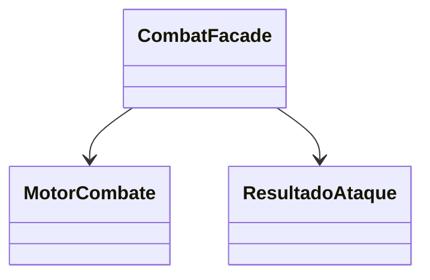

# Patron Facade en Runtime

- Fecha de creacion: 2026-04-09
- Rama auditada: master
- Estado: vigente

## Problema real que resuelve
El subsistema de combate expone varios pasos internos (motor, rondas, efectos,
log, estadisticas). Se requiere una API simple para el cliente.

## Clases principales (rutas reales)
- `src/main/java/game/combat/facade/CombatFacade.java`
- `src/main/java/game/combat/engine/MotorCombate.java`
- `src/main/java/game/combat/model/ResultadoAtaque.java`

## Conexion con runtime productivo
- `CombatFacade` encapsula inicio, ejecucion de rondas, cierre y consulta de
  estadisticas de combate.
- Reduce acoplamiento del cliente con clases internas del motor.

## Test de validacion en runtime real
- `src/test/java/game/unit/structural/FacadePatternTest.java`

## Diagrama minimo

