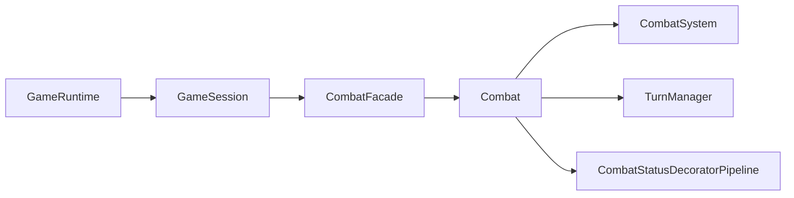

# Patron Facade en runtime productivo

- Fecha de revision: 2026-04-13
- Rama: Refactorizacion
- Estado: remediado e integrado al flujo real

## Problema real que resuelve
El runtime de aplicacion necesita un punto de entrada unico para combate.
Sin Facade, los casos de uso y la sesion se acoplan a demasiados detalles del
agregado de combate. Con Facade, el runtime orquesta acciones de combate sin
conocer los subsistemas internos.

## Cadena real de invocacion
`GameRuntime` recibe comandos UI (`attack`, `defend`, `useSkill`, `retreatCombat`) y
delegan en use cases. Los use cases usan `GameSession.combat()` y ese punto ahora
retorna `CombatFacade`.

Ruta real:
`GameRuntime -> GameSession -> CombatFacade -> Combat -> [CombatSystem, TurnManager, CombatStatusDecoratorPipeline]`

## Clases y rutas reales
- `src/main/java/game/application/runtime/GameRuntime.java`
- `src/main/java/game/application/state/GameSession.java`
- `src/main/java/game/application/state/GameSessionFactory.java`
- `src/main/java/game/patterns/combat/facade/CombatFacade.java`
- `src/main/java/game/domain/combat/Combat.java`
- `src/main/java/game/domain/combat/CombatSystem.java`
- `src/main/java/game/domain/turn/TurnManager.java`
- `src/main/java/game/domain/combat/CombatStatusDecoratorPipeline.java`

## Metodos publicos productivos de CombatFacade
- `start(Enemy enemy, boolean bossFight)`
- `finish()`
- `isActive()`
- `currentEnemy()`
- `isBossFight()`
- `attack(String targetId, String themeKey)`
- `defend(String themeKey)`
- `useSkill(String requestedSkillName, String themeKey)`
- `useItem(Item item, String themeKey)`
- `retreatAttempt(String heroType, String themeKey)`
- `setCombatStyle(String requestedStyle, String themeKey)`
- `applyStackingBuff(String requestedBuffType, String themeKey)`
- `applyBuff(String requestedBuffType, String themeKey)`
- `saveTacticalCheckpoint()`
- `rollbackTacticalCheckpoint()`
- `resolveTurn()`
- `playerStyle()`
- `offensiveBuffStacks()`
- `guardBuffStacks()`
- `isDefenseActive()`
- `poisonTurns()`
- `poisonDamage()`
- `hasTacticalCheckpoint()`
- `tacticalCheckpointConsumed()`
- `tacticalCheckpoint()`
- `restoreTurnState(boolean defenseActive, int poisonTurns, int poisonDamage)`
- `restoreActiveEnemy(Enemy enemy, boolean bossFight)`
- `restoreTacticalState(String styleKey, int offensiveStacks, int guardStacks, Combat.TacticalCheckpoint checkpoint, boolean checkpointConsumed)`
- `isCombatOver()`
- `getStatus()`

## Subsistemas encapsulados por CombatFacade
- `game.domain.combat.Combat`
    - Agregado que centraliza reglas de combate por turnos.
- `game.domain.combat.CombatSystem`
    - Danio, iniciativa, estrategias de IA y acciones de jugador/enemigo.
- `game.domain.turn.TurnManager`
    - Estado transitorio (defensa activa, veneno y ticks).
- `game.domain.combat.CombatStatusDecoratorPipeline`
    - Aplicacion de modificadores de estado (poison, guard, power).

## Compatibilidad estructural
Se mantiene una API legacy en `CombatFacade` (`iniciarCombate`, `ejecutarRonda`,
`ejecutarCombateCompleto`) para pruebas estructurales del patron con
`CharacterDecorator` y `MotorCombate`, sin romper el flujo productivo.

## Tests de validacion
- `src/test/java/game/unit/structural/FacadePatternTest.java`
- `src/test/java/game/integration/structural/FacadeIntegrationTest.java`

## Diagrama

