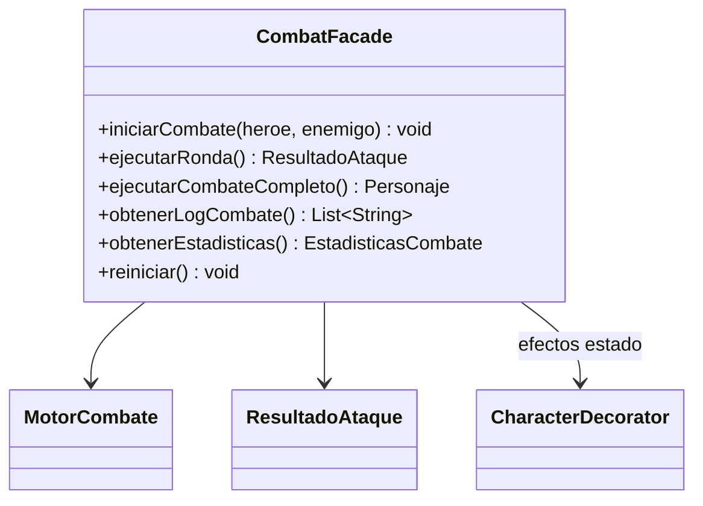

# Patron Facade en Runtime

- Fecha de revision: 2026-04-13
- Estado: vigente

## Problema real que resuelve
El subsistema de combate expone varios pasos internos (motor, rondas, efectos,
log, estadisticas). Se requiere una API simple y sin acoplamiento para el cliente.

## Clases principales (rutas reales)
- `src/main/java/game/patterns/combat/facade/CombatFacade.java`
- `src/main/java/game/combat/engine/MotorCombate.java`
- `src/main/java/game/combat/model/ResultadoAtaque.java`
- `src/main/java/game/effects/status/CharacterDecorator.java`
- `src/main/java/game/domain/personaje/Personaje.java`

## Conexion con runtime productivo
- `CombatFacade` encapsula inicio (`iniciarCombate`), ejecucion de rondas (`ejecutarRonda`)
    y combate completo (`ejecutarCombateCompleto`).
- Reduce acoplamiento del cliente con `MotorCombate` y las clases internas del motor.
- Expone API simplificada para log y estadisticas (`obtenerLogCombate`, `obtenerEstadisticas`).
- Integra aplicacion de efectos de estado (`CharacterDecorator`) de forma transparente.

## Test de validacion en runtime real
- `src/test/java/game/unit/structural/FacadePatternTest.java`

## Diagrama

