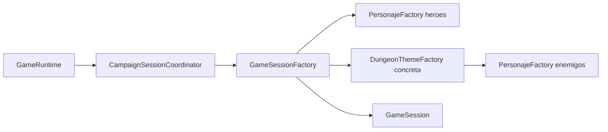

# Patron Factory Method en runtime productivo

- Fecha de revision: 2026-04-13
- Rama: Refactorizacion
- Estado: remediado e integrado

## Problema real que resuelve
Factory Method evita instanciacion directa de tipos concretos en el flujo de runtime.
Las factories de tema delegan la creacion de enemigos en `PersonajeFactory` concretas,
y `GameSessionFactory` hace lo mismo para héroes.

## Clases reales en flujo activo
- `src/main/java/game/domain/personaje/factory/PersonajeFactory.java`
- `src/main/java/game/domain/personaje/factory/GuerreroFactory.java`
- `src/main/java/game/domain/personaje/factory/MagoFactory.java`
- `src/main/java/game/domain/personaje/factory/ArqueroFactory.java`
- `src/main/java/game/domain/personaje/factory/DragonFactory.java`
- `src/main/java/game/domain/personaje/factory/OrcoFactory.java`
- `src/main/java/game/domain/personaje/factory/EnemigoBasicoFactory.java`
- `src/main/java/game/dungeon/theme/FireThemeFactory.java`
- `src/main/java/game/dungeon/theme/IceThemeFactory.java`
- `src/main/java/game/dungeon/theme/PoisonThemeFactory.java`
- `src/main/java/game/dungeon/theme/DarkThemeFactory.java`
- `src/main/java/game/application/state/GameSessionFactory.java`
- `src/main/java/game/application/runtime/CampaignSessionCoordinator.java`

## Cadena real de invocacion
1. `GameRuntime` delega en `CampaignSessionCoordinator` para crear sesiones de campaña.
2. `CampaignSessionCoordinator` usa `GameSessionFactory.createSessionForThemeRandomized(...)`.
3. `GameSessionFactory.createPlayerForHero(...)` crea héroes usando factories concretas (`GuerreroFactory`, `MagoFactory`, `ArqueroFactory`).
4. `DungeonThemeFactory` concreta crea enemigos delegando en `EnemigoBasicoFactory`, `OrcoFactory` y `DragonFactory`.

## Integracion productiva remediada
- En `FireThemeFactory`, `IceThemeFactory`, `PoisonThemeFactory` y `DarkThemeFactory` ya no se instancia `new Dragon/new Orco/new EnemigoBasico` de forma directa.
- Cada método `crearEnemigoBasico/crearEnemigoMedio/crearJefe` delega a `PersonajeFactory` concreta con el mismo nombre y stats observables.
- Se conserva comportamiento: mismo tipo final de enemigo, mismo nombre, misma vida base y mismo valor de daño base.

## Metodos clave documentados
- `GameSessionFactory.createSessionForThemeRandomized(String themeKey, String heroType)`
- `GameSessionFactory.createPlayerForHero(String heroType)`

## Tests relevantes
- `src/test/java/game/unit/creational/FactoryMethodTest.java`
  - cobertura de `DragonFactory` y `OrcoFactory`
  - contrato de integración de `FireThemeFactory` para jefe tipo `Dragon`
- `src/test/java/game/unit/application/GameRuntimeHeroSelectionTest.java`
  - `heroType=guerrero` produce la clase Java compatible con `GuerreroFactory`

## Diagrama de ruta completa

