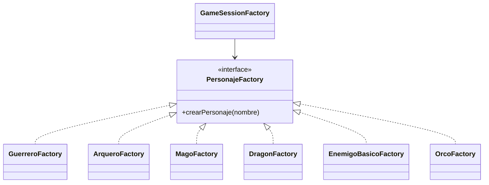

# Patron Factory Method en Runtime

- Fecha de creacion: 2026-04-09
- Rama auditada: master
- Estado: vigente

## Problema real que resuelve
El runtime debe crear personajes (heroes y enemigos) sin acoplar la logica de
instanciacion a una sola clase concreta.

## Clases principales (rutas reales)
- `src/main/java/game/domain/personaje/factory/PersonajeFactory.java`
- `src/main/java/game/domain/personaje/factory/GuerreroFactory.java`
- `src/main/java/game/domain/personaje/factory/ArqueroFactory.java`
- `src/main/java/game/domain/personaje/factory/MagoFactory.java`
- `src/main/java/game/domain/personaje/factory/DragonFactory.java`
- `src/main/java/game/domain/personaje/factory/EnemigoBasicoFactory.java`
- `src/main/java/game/domain/personaje/factory/OrcoFactory.java`
- `src/main/java/game/application/state/GameSessionFactory.java`

## Conexion con runtime productivo
- `GameSessionFactory` selecciona el tipo de heroe y delega la creacion en
  factories concretas via `crearPersonaje(...)`.
- El flujo evita condicionales de construccion dispersos y centraliza perfiles.
- El modulo incluye factories de enemigos listas para escenarios de combate
  especializados y pruebas.

## Test de validacion en runtime real
- `src/test/java/game/unit/creational/FactoryMethodTest.java`

## Diagrama minimo

