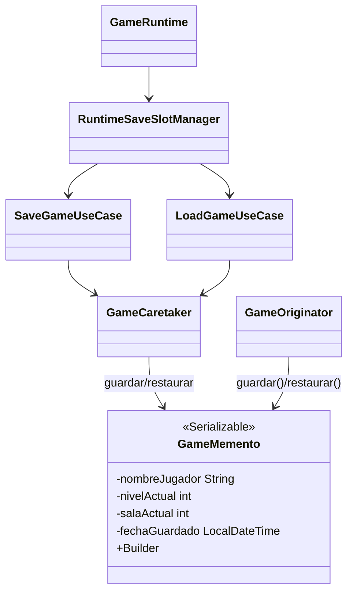

# Patron Memento en Runtime

- Fecha de revision: 2026-04-13
- Estado: vigente

## Problema real que resuelve
El runtime necesita guardar y restaurar sesion completa (pantalla, progreso de mazmorra,
inventario, combate, seed) sin exponer internals de estado mutable.

## Clases principales (rutas reales)
- `src/main/java/game/application/state/GameMemento.java` (Memento — inmutable, Serializable)
- `src/main/java/game/infrastructure/persistence/memento/GameCaretaker.java` (Caretaker — persistencia fisica)
- `src/main/java/game/infrastructure/persistence/memento/GameOriginator.java` (Originator)
- `src/main/java/game/application/usecase/SaveGameUseCase.java`
- `src/main/java/game/application/usecase/LoadGameUseCase.java`
- `src/main/java/game/application/runtime/RuntimeSaveSlotManager.java`

## Conexion con runtime productivo
- `GameRuntime` delega save/load al `RuntimeSaveSlotManager`.
- `SaveGameUseCase` y `LoadGameUseCase` usan `GameCaretaker` como store de snapshots.
- `GameOriginator` provee contrato clasico de captura/restauracion de estado con `GameMemento`.
- `GameMemento` usa patron Builder interno para construccion inmutable.
- Persistencia fisica: serialization Java a disco en `./saves/`.

## Test de validacion en runtime real
- `src/test/java/game/unit/behavioral/MementoPatternTest.java`
- `src/test/java/game/unit/application/SaveLoadUseCaseTest.java`
- `src/test/java/game/unit/application/GameRuntimeLoadGameTest.java`

## Diagrama

