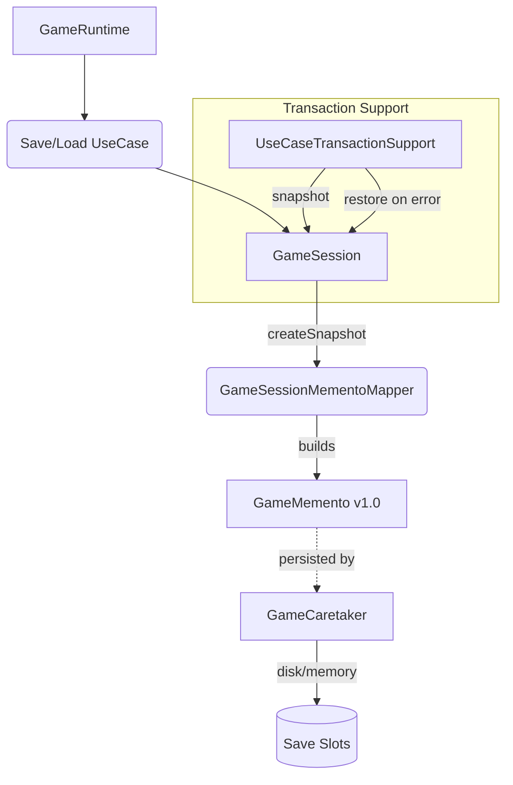

# Patrón Memento en Runtime

- Fecha de actualización: 2026-04-13
- Estado: ✅ Remediado

## Problema real que resuelve
El sistema necesita persistir y restaurar sesiones completas (progresión, inventario, estado de mazmorra, combate activo) garantizando la integridad de los datos y permitiendo rollbacks ante fallos en casos de uso.

## Clases Principales (Rutas Reales)
- `game.application.state.GameMemento`: El **Memento**. Objeto inmutable y serializable que contiene el snapshot del estado. Incluye validación de `schemaVersion`.
- `game.application.state.GameSessionMementoMapper`: El **Originator** real del sistema productivo. Transforma una `GameSession` compleja en un `GameMemento` y viceversa.
- `game.infrastructure.persistence.memento.GameCaretaker`: El **Caretaker**. Gestiona el almacenamiento físico en disco y memoria de los mementos. Implementa `SessionSnapshotStore`.
- `game.application.usecase.UseCaseTransactionSupport`: Uso de Memento para **Rollback**. Toma un snapshot antes de ejecutar un caso de uso y lo restaura si ocurre una excepción runtime.

## Validación de Versiones (Schema Versioning)
Para prevenir la carga de datos incompatibles tras actualizaciones del código, `GameMemento` incluye un campo `schemaVersion` (actualmente `"1.0"`).
- `toMemento()`: Setea la versión actual.
- `restoreStrict()`: Valida que la versión del memento coincida con la esperada, lanzando `SaveDataCorruptionException` ante discrepancias.

## Conexión con Runtime Productivo
- Se ha eliminado la clase legacy `GameOriginator`, centralizando la lógica en el flujo productivo de `GameSession`.
- `SaveGameUseCase` y `LoadGameUseCase` orquestan la persistencia delegando en el Mapper y el Caretaker.
- El sistema de transacciones en los casos de uso garantiza que el juego nunca quede en un estado inconsistente tras un error inesperado.

## Diagrama de Flujo Productivo

## Validación de Integración
- **Tests de Esquema**: `MementoPatternTest.testEsquemaIncompatibleLanzaExcepcion` verifica la protección contra versiones antiguas o corruptas.
- **Tests de Integración**: `BehavioralPatternsIntegrationTest` valida la persistencia y restauración de niveles y progreso real.
- **Tests de Transacción**: Los casos de uso que utilizan `UseCaseTransactionSupport` garantizan la atomicidad mediante mementos.
