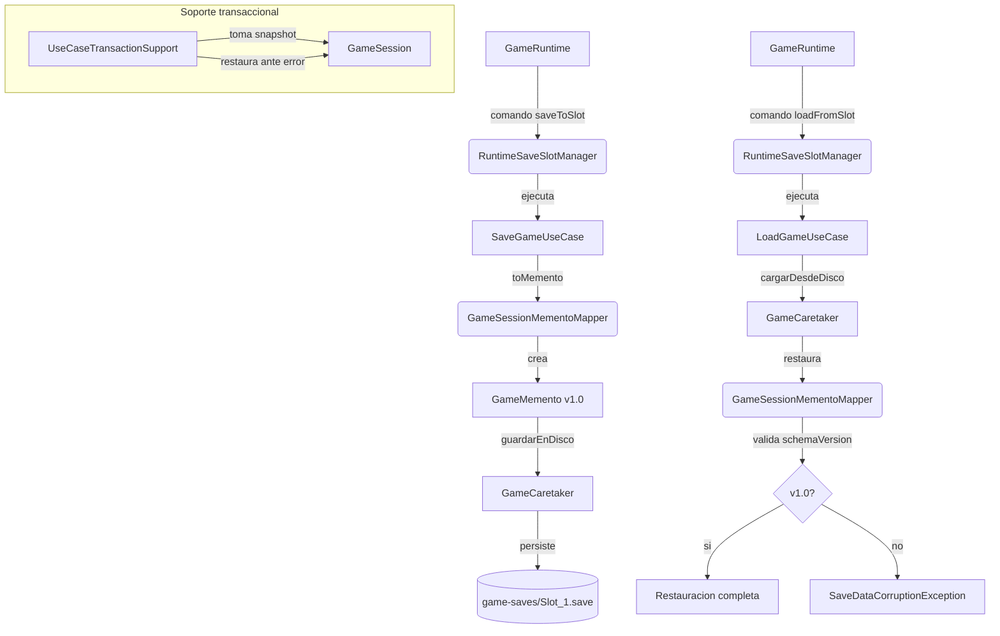

# Patrón Memento en Runtime

- Fecha de actualización: 2026-04-20
- Estado: ✅ Remediado

## Problema real que resuelve

El sistema necesita persistir y restaurar sesiones completas (progresión, inventario, estado de mazmorra, combate activo) garantizando la integridad de los datos y permitiendo rollbacks ante fallos en casos de uso.

## Clases Principales (Rutas Reales)

### Patrón Memento Productivo

- `game.application.state.GameMemento`: El **Memento**. Objeto inmutable y serializable que contiene el snapshot del estado. Incluye validación de `schemaVersion = "1.0"`.
- `game.application.state.GameSessionMementoMapper`: El **Originator** real del sistema productivo. Transforma una `GameSession` compleja en un `GameMemento` y viceversa. Métodos: `toMemento()`, `restoreStrict()`, `restore()`.
- `game.infrastructure.persistence.memento.GameCaretaker`: El **Caretaker**. Gestiona el almacenamiento físico en disco y memoria de los mementos. Implementa `SessionSnapshotStore`. Métodos: `guardarEnDisco()`, `cargarDesdeDisco()`, `existeEnDisco()`.

### Excepciones y Validación

- `game.infrastructure.persistence.memento.SaveDataCorruptionException`: Lanzada cuando se detecta incompatibilidad de schemaVersion al restaurar.
- `game.application.ports.persistence.SaveSlotNotFoundException`: Lanzada cuando se intenta cargar desde un slot vacío.

### Use Cases de Orquestación

- `game.application.usecase.SaveGameUseCase`: Invoca `GameSessionMementoMapper.toMemento()` y `GameCaretaker.guardarEnDisco()`.
- `game.application.usecase.LoadGameUseCase`: Invoca `GameCaretaker.cargarDesdeDisco()` y `GameSessionMementoMapper.restoreStrict()`.

### Soporte Transaccional

- `game.application.usecase.UseCaseTransactionSupport`: Usa Memento para **Rollback**. Toma un snapshot antes de ejecutar un caso de uso y lo restaura si ocurre una excepción runtime.

### Integración en Runtime

- `game.application.runtime.RuntimeSaveSlotManager`: Gestor de persistencia productivo. Resuelve slots (explícitos o preferidos) e invoca `SaveGameUseCase`/`LoadGameUseCase`.

## Validación de Versiones (Schema Versioning)

Para prevenir la carga de datos incompatibles tras actualizaciones del código, `GameMemento` incluye un campo `schemaVersion` (actualmente `"1.0"`).

- `GameSessionMementoMapper.toMemento()`: Setea `schemaVersion = "1.0"` en cada memento creado.
- `GameSessionMementoMapper.restoreStrict()`: Valida que `memento.getSchemaVersion().equals("1.0")`, lanzando `SaveDataCorruptionException` con mensaje descriptivo ante discrepancias.
- Ejemplo de error: `SaveDataCorruptionException("Incompatible schema version: 0.9")`

## Conexión con Runtime Productivo

### Flujo de Guardado

```
GameRuntime.handleCommand("saveToSlot", slot=1)
  → RuntimeSaveSlotManager.saveToSlot(1)
    → SaveGameUseCase(session).execute(1)
      → GameSessionMementoMapper.toMemento(session)  // schemaVersion="1.0"
        → GameMemento memento
          → GameCaretaker.guardarEnDisco(memento, "Slot_1")
            → /game-saves/Slot_1.save
```

### Flujo de Carga

```
GameRuntime.handleCommand("loadFromSlot", slot=1)
  → RuntimeSaveSlotManager.loadFromSlot(1)
    → GameCaretaker.cargarDesdeDisco("Slot_1")
      → GameMemento memento (con schemaVersion="1.0")
        → GameSessionMementoMapper.restoreStrict(targetSession, memento)
          → ✅ Valida versión y restaura estado completo
```

### Aislamientos y Garantías

- Se ha eliminado la clase legacy `GameOriginator`, centralizando la lógica en `GameSessionMementoMapper`.
- Cada sesión tiene su propio `GameCaretaker` (no compartido) garantizando aislamiento.
- El sistema de transacciones en los casos de uso (`UseCaseTransactionSupport`) garantiza que el juego nunca quede en un estado inconsistente tras un error inesperado.

## Diagrama de Flujo Productivo



## Cobertura de Tests

### Pruebas Unitarias (MementoPatternTest)

- `testCreateMemento()`: Verifica creación de memento con schemaVersion correcta.
- `testRestoreFromMemento()`: Verifica restauración de estado completo.
- `testEsquemaIncompatibleLanzaExcepcion()`: **Crítica** - Verifica `SaveDataCorruptionException` con schemaVersion="0.9".
- `testSaveLoadUseCaseWithCorruption()`: Verifica detección de corrupción al deserializar.
- `testSlotVacioLanzaExcepcion()`: Verifica `SaveSlotNotFoundException` para slots no existentes.

### Pruebas de Integración (SaveLoadUseCaseTest)

- `savePersistsExtendedDomainState()`: Verifica persistencia de todos los campos (vida, recursos, combate, inventario).
- `saveRejectsActiveCombatState()`: Valida restricción: no guardar durante combate.
- `saveRejectsBootstrapMenuSession()`: Valida restricción: no guardar antes de iniciar partida.
- `loadRestoresSavedSessionState()`: Verifica restauración fiel de todos los campos.
- `loadRejectsMissingSlotAndKeepsSessionUntouched()`: Verifica atomicidad: si falla, no modifica sesión.
- `loadRejectsCorruptMementoAndKeepsSessionUntouched()`: Verifica robustez ante datos corruptos.
- `loadToleratesInvalidInventoryItemEntriesInLegacySaves()`: Verifica compatibilidad hacia atrás con errores menores.

### Pruebas End-to-End (RuntimeFlowE2EIntegrationTest)

- Flujo completo: `heroNewGame` → `saveToSlot(2)` → `heroNewGame` (diferente) → `loadFromSlot(2)` → Verifica restauración exacta.

## Validación de Integración

- **✅ Producción**: Flujo real desde GameRuntime → RuntimeSaveSlotManager → SaveLoadUseCase → Mapper → Caretaker.
- **✅ Tests**: 5 tests unitarios + 7 tests de integración + 1 test E2E = 13 tests del patrón Memento.
- **✅ Sin bypasses**: El código productivo NO bypasea el patrón; toda persistencia pasa por Memento.
- **✅ Versionado**: Protección contra datos incompatibles mediante schemaVersion validado en cada carga.
