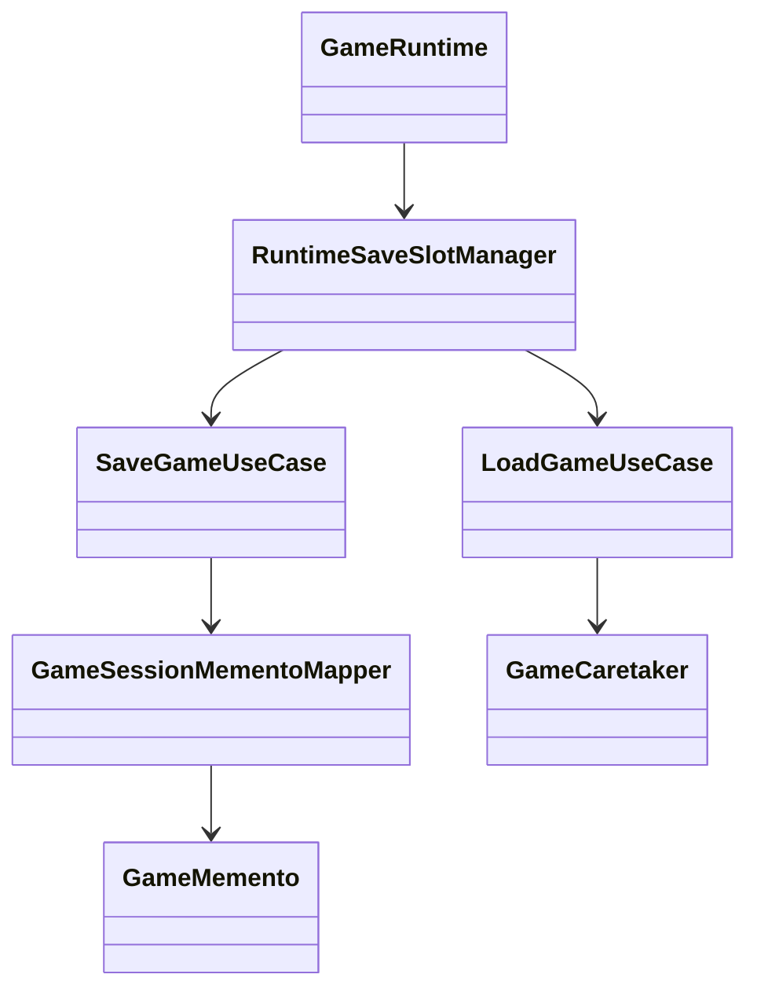

# Patron Memento en Runtime

- Fecha de creacion: 2026-04-04
- Rama auditada: Flujo-de-mazmorra
- Estado: vigente

## Problema real que resuelve
El runtime necesita guardar y restaurar sesion completa (pantalla, progreso de mazmorra, inventario, combate, seed) sin exponer internals de estado mutable.

## Clases principales (rutas reales)
- `src/main/java/game/persistence/memento/GameMemento.java`
- `src/main/java/game/persistence/memento/GameCaretaker.java`
- `src/main/java/game/application/state/GameSessionMementoMapper.java`
- `src/main/java/game/application/usecase/SaveGameUseCase.java`
- `src/main/java/game/application/usecase/LoadGameUseCase.java`
- `src/main/java/game/application/runtime/RuntimeSaveSlotManager.java`

## Conexion con runtime productivo
- `GameRuntime` delega save/load al `RuntimeSaveSlotManager`.
- `SaveGameUseCase` serializa `GameSession` a memento mediante mapper.
- `LoadGameUseCase` restaura sesion desde memento validado.

## Test de validacion en runtime real
- `src/test/java/game/unit/application/SaveLoadUseCaseTest.java`
- `src/test/java/game/unit/application/GameRuntimeLoadGameTest.java`

## Diagrama minimo

