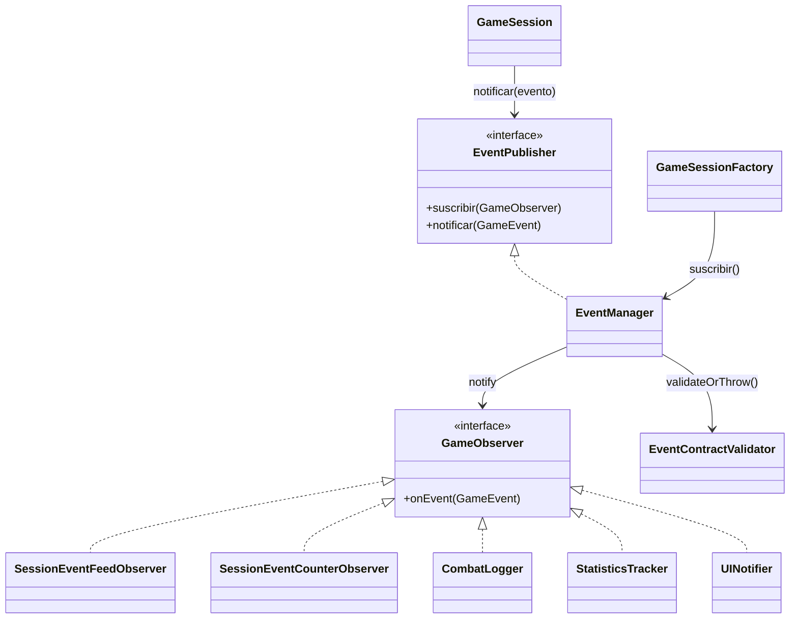

# Patron Observer en Runtime

- Fecha de revision: 2026-04-13
- Estado: vigente

## Problema real que resuelve
El sistema necesita reaccionar a eventos de juego (inicio, combate, loot, guardado)
sin acoplar cada emisor a cada consumidor.

## Clases principales (rutas reales)
- `src/main/java/game/infrastructure/events/observer/EventManager.java` (Subject - Singleton)
- `src/main/java/game/infrastructure/events/observer/EventContractValidator.java`
- `src/main/java/game/application/ports/events/GameObserver.java` (interfaz Observer)
- `src/main/java/game/application/ports/events/GameEvent.java`
- `src/main/java/game/application/ports/events/EventType.java`
- `src/main/java/game/application/ports/events/EventPublisher.java`
- `src/main/java/game/application/observer/SessionEventFeedObserver.java`
- `src/main/java/game/application/observer/SessionEventCounterObserver.java`
- `src/main/java/game/infrastructure/events/observer/CombatLogger.java`
- `src/main/java/game/infrastructure/events/observer/StatisticsTracker.java`
- `src/main/java/game/infrastructure/events/observer/UINotifier.java`
- `src/main/java/game/application/state/GameSessionFactory.java` (registro productivo)

## Conexion con runtime productivo
- Casos de uso y sesion emiten eventos via `EventPublisher` (implementado por `EventManager`).
- `GameSessionFactory` registra observers antes de emitir `JUEGO_INICIADO`.
- `EventContractValidator` valida payloads en cada notificacion.
- `EventManager` implementa Singleton para acceso global gestionado.
- El paquete productivo vigente es `game.infrastructure.events.observer`.

## Test de validacion en runtime real
- `src/test/java/game/integration/behavioral/EventObserversRuntimeIntegrationTest.java`

## Diagrama

