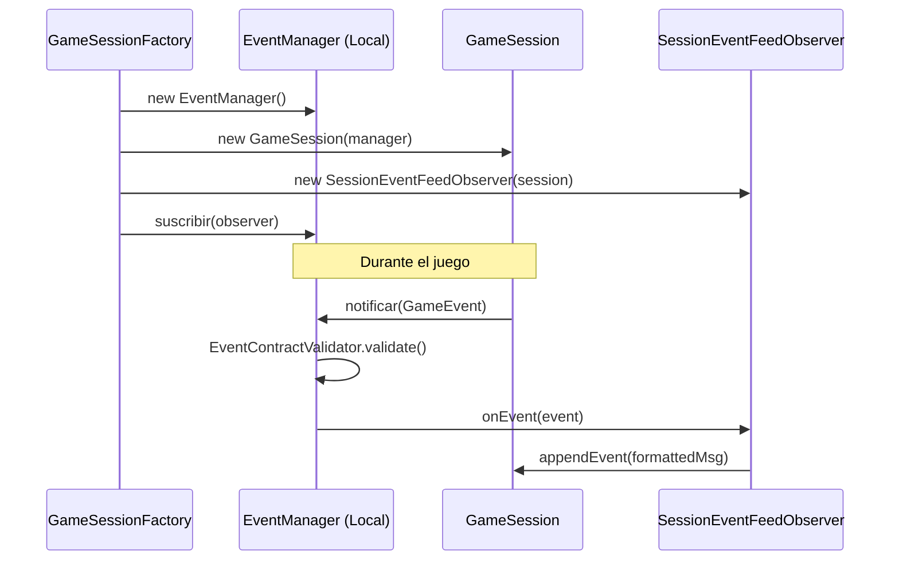

# Patrón Observer en Runtime

- Fecha de actualización: 2026-04-13
- Estado: ✅ Remediado

## Problema real que resuelve
El sistema necesita reaccionar a eventos de juego (inicio, combate, loot, guardado) sin acoplar cada emisor a cada consumidor. El problema crítico remediado era el **aislamiento de sesión**: anteriormente, los observers eran estáticos y compartidos, lo que causaba que eventos de una partida se filtraran en otra en entornos multi-sesión.

## Implementación de Aislamiento y Concurrencia
Se ha abandonado el modelo de observers estáticos compartidos en favor de un modelo de instanciación local por sesión. Cada `GameSession` recibe su propio `EventPublisher` (instancia de `EventManager`) al ser creada por la `GameSessionFactory`.

### Observers Productivos de Sesión
Instanciados uno por sesión, con referencia inmutable (`final`) a su sesión correspondiente:
- `game.application.observer.SessionEventFeedObserver`: Transforma eventos técnicos en mensajes legibles para el log de la UI.
- `game.application.observer.SessionEventCounterObserver`: Mantiene estadísticas internas de la sesión (eventos observados).

### Observers de Infraestructura (Monitoring/Test)
- `game.infrastructure.events.observer.CombatLogger`: Utilizado para depuración de flujos de combate.
- `game.infrastructure.events.observer.StatisticsTracker`: Utilizado en analítica y tests unitarios.

## Clases Principales (Rutas Actualizadas)
- `game.infrastructure.events.observer.EventManager`: Sujeto principal. Ahora implementa **Eager Singleton** thread-safe y permite instancias independientes para aislamiento de sesiones. Usa `CopyOnWriteArrayList` internamente para evitar `ConcurrentModificationException`.
- `game.application.ports.events.GameObserver`: Interfaz que define el contrato de escucha.
- `game.application.state.GameSessionFactory`: Responsable de instanciar y suscribir los observers locales de cada sesión.

## Cadena Real de Invocación

## Validación de Integración
- **Aislamiento de Sesión**: Un test de integración verifica que al ejecutar dos sesiones simultáneas, los eventos de la Sesión A NO aparecen en los logs o contadores de la Sesión B.
- **Doble Suscripción**: `EventManager` garantiza que un mismo observer no sea notificado dos veces por el mismo evento mediante validaciones internas.
- **Thread-Safety**: El uso de colecciones concurrentes en `EventManager` asegura estabilidad en entornos de alta frecuencia de eventos.

## Tests de validación
- `game.integration.behavioral.EventObserversRuntimeIntegrationTest` (Aislamiento y flujo real).
- `game.unit.behavioral.ObserverPatternTest` (Contrato y Singleton).
