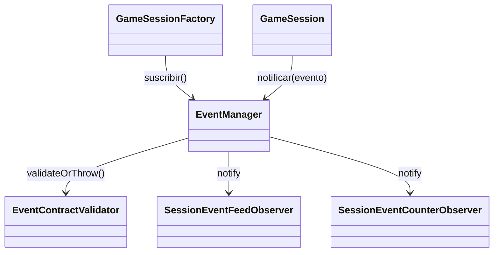

# Patron Observer en Runtime

- Fecha de creacion: 2026-04-04
- Rama auditada: Flujo-de-mazmorra
- Estado: vigente

## Problema real que resuelve
El sistema necesita reaccionar a eventos de juego (inicio, combate, loot, guardado) sin acoplar cada emisor a cada consumidor.

## Clases principales (rutas reales)
- `src/main/java/game/events/observer/EventManager.java`
- `src/main/java/game/events/observer/EventContractValidator.java`
- `src/main/java/game/events/observer/GameEvent.java`
- `src/main/java/game/application/observer/SessionEventFeedObserver.java`
- `src/main/java/game/application/observer/SessionEventCounterObserver.java`
- `src/main/java/game/application/state/GameSessionFactory.java` (registro productivo de observers)

## Conexion con runtime productivo
- Casos de uso y session emiten eventos con `session.eventManager().notificar(...)`.
- `GameSessionFactory` registra observers de sesion antes de emitir `JUEGO_INICIADO`.
- `EventContractValidator` valida payloads en cada notificacion.

## Test de validacion en runtime real
- `src/test/java/game/integration/behavioral/EventObserversRuntimeIntegrationTest.java`

## Diagrama minimo

