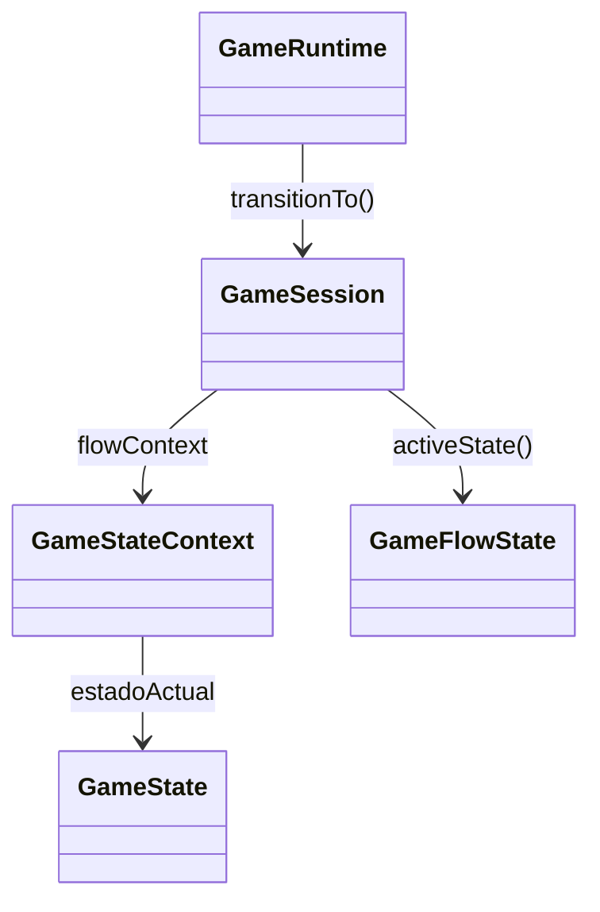

# Patron State en Runtime

- Fecha de creacion: 2026-04-04
- Rama auditada: Flujo-de-mazmorra
- Estado: vigente

## Problema real que resuelve
El runtime necesita transiciones de pantalla coherentes (`menu`, `hero`, `exploration`, `combat`, `treasure`, etc.) sin depender de strings mutables dispersos.

## Clases principales (rutas reales)
- `src/main/java/game/state/game/GameStateContext.java`
- `src/main/java/game/state/game/GameState.java`
- `src/main/java/game/application/state/GameFlowState.java`
- `src/main/java/game/application/state/GameSession.java` (usa `GameStateContext` via `transitionTo`)
- `src/main/java/game/application/runtime/GameRuntime.java` (dispara transiciones por comando)

## Conexion con runtime productivo
- `GameRuntime` procesa comandos y llama `session.transitionTo(...)`.
- `GameSession` delega transicion en `GameStateContext`.
- `activeScreen` se sincroniza desde el estado del contexto; no conduce el flujo.

## Test de validacion en runtime real
- `src/test/java/game/integration/behavioral/GameRuntimeStateFlowIntegrationTest.java`

## Diagrama minimo

