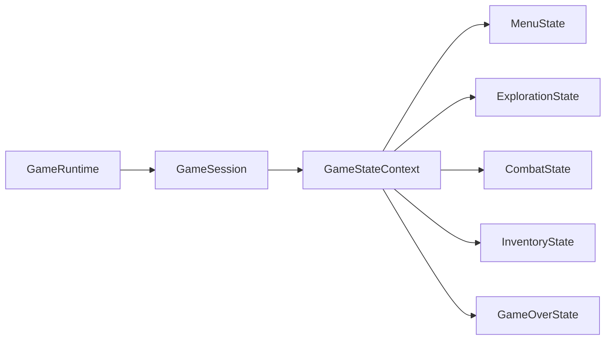

# Patron State en runtime productivo

- Fecha de revision: 2026-04-13
- Rama: Refactorizacion
- Estado: remediado e integrado

## Problema real que resuelve

El runtime necesita que el estado activo gobierne:

- que acciones de comando son validas en cada pantalla
- que transiciones entre pantallas son permitidas

Con esto se elimina la dependencia de strings hardcodeados en use cases y se centraliza
la politica de flujo en `GameStateContext` + estados concretos.

## Clases y rutas reales del flujo activo

- `src/main/java/game/application/runtime/GameRuntime.java`
- `src/main/java/game/state/game/runtime/GameRuntimeCoordinator.java`
- `src/main/java/game/application/state/GameSession.java`
- `src/main/java/game/application/state/GameFlowState.java`
- `src/main/java/game/state/game/GameStateContext.java`
- `src/main/java/game/state/game/GameState.java`

Clases de estado concretas validadas (contrato State):

- `src/main/java/game/state/game/MenuState.java`
- `src/main/java/game/state/game/ExplorationState.java`
- `src/main/java/game/state/game/CombatState.java`
- `src/main/java/game/state/game/InventoryState.java`
- `src/main/java/game/state/game/GameOverState.java`

## Cadena real de invocacion

1. `GameRuntime.handleCommand(...)` valida la accion contra el estado activo.
2. `GameSession.assertActionAllowed(...)` delega en `GameStateContext.assertAccionPermitida(...)`.
3. `GameSession.transitionTo(...)` delega en `GameStateContext.transitionTo(...)`.
4. El estado concreto decide si permite o no la accion/transicion.

Ruta:
`GameRuntime -> GameSession -> GameStateContext -> GameState (estado activo)`

## Transiciones validas por estado (flujo productivo)

- `menu -> hero|saves|stats|exploration`
- `hero -> exploration|menu|saves|stats`
- `exploration -> combat|inventory|saves|stats|treasure|menu|hero|gameover`
- `combat -> treasure|exploration|inventory|gameover`
- `inventory -> exploration|combat|saves|menu`
- `treasure -> exploration|hero|menu`
- `stats -> menu`
- `saves -> exploration|menu|hero|gameover`
- `gameover -> menu|saves|hero|exploration`

## Orquestacion de arranque

`GameRuntimeCoordinator` gestiona:

- resolucion de sesion inicial de runtime (`resolveInitialSession`)
- secuencia de estados hasta exploracion al iniciar partida (`orchestrateSessionToExploration`)

## Cobertura de tests (feliz, borde, negativo e integración)

- `src/test/java/game/unit/behavioral/StatePatternTest.java`
  - accion de combate rechazada en `MenuState`
  - transicion invalida `Menu -> GameOver` bloqueada
- `src/test/java/game/integration/behavioral/GameRuntimeStateFlowIntegrationTest.java`
  - flujo completo `Menu -> Hero -> Exploration -> Combat -> Victory/Treasure -> Exploration -> GameOver`
  - verificacion de cambio de acciones disponibles por estado

## Diagrama del flujo



## Interfaz GameState

```java
public interface GameState {
    void manejarEntrada(String entrada);
    void actualizar();
    void render();
    void onEnter();
    void onExit();
    String getNombre();
    default boolean permiteAccion(String accion) { ... }
    default boolean permiteTransicionA(String nombreEstadoDestino) { ... }
}
```

## Context GameStateContext

```java
public class GameStateContext {
    private GameState estadoActual;
    private boolean ejecutando;

    public void cambiarEstado(GameState nuevoEstado);
    public void transitionTo(GameState nuevoEstado);
    public void procesarEntrada(String entrada);
    public boolean permiteAccion(String accion);
    public void assertAccionPermitida(String accion);
    public void actualizar();
    public void render();
    public void ejecutarLoop();
    public void detener();
    public GameState getEstadoActual();
    public boolean isEjecutando();
}
```

## Estados Concretos Implementados

| Estado             | Archivo                                               | Transiciones permitidas                                         |
| ------------------ | ----------------------------------------------------- | --------------------------------------------------------------- |
| `MenuState`        | `src/main/java/game/state/game/MenuState.java`        | hero, saves, stats, exploration                                 |
| `ExplorationState` | `src/main/java/game/state/game/ExplorationState.java` | combat, inventory, saves, stats, treasure, menu, hero, gameover |
| `CombatState`      | `src/main/java/game/state/game/CombatState.java`      | treasure, exploration, inventory, gameover                      |
| `InventoryState`   | `src/main/java/game/state/game/InventoryState.java`   | exploration, combat, saves, menu                                |
| `GameOverState`    | `src/main/java/game/state/game/GameOverState.java`    | menu, saves, hero, exploration                                  |

## Métodos públicos clave

### GameStateContext

- `cambiarEstado(GameState nuevoEstado)`: Transición con validación de permisos. Invoca `onExit()` del estado anterior y `onEnter()` del nuevo.
- `transitionTo(GameState nuevoEstado)`: Alias semántico para `cambiarEstado()`.
- `assertAccionPermitida(String accion)`: Valida si la acción es permitida en el estado actual. Lanza `IllegalStateException` si no.
- `procesarEntrada(String entrada)`: Delega procesamiento de entrada al estado actual vía `manejarEntrada()`.
- `permiteAccion(String accion)`: Retorna `boolean` indicando si la acción es permitida sin lanzar excepción.
