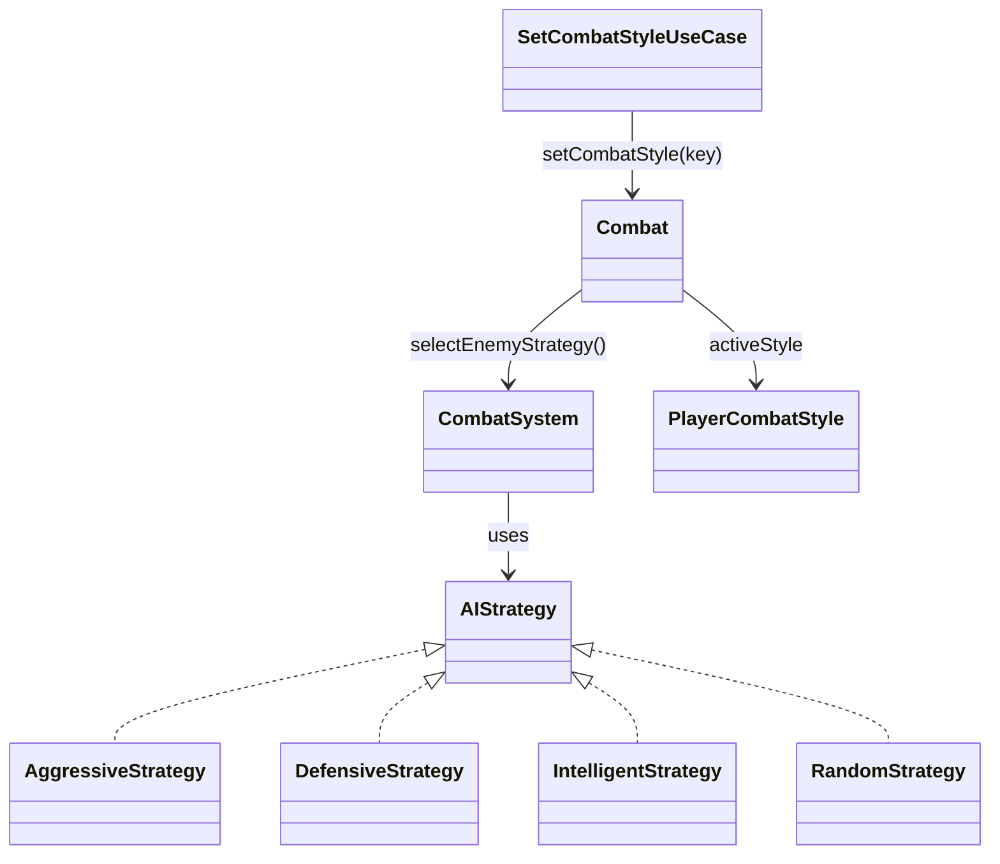

# Patrón Strategy en Runtime

- Fecha de actualización: 2026-04-13
- Estado: ✅ Remediado

## Problema real que resuelve
El combate necesita comportamiento variable sin condicionales monolíticos: estrategia de IA enemiga y estilo táctico del jugador. La remediación ha unificado el sistema de IA adaptativa en el núcleo del combate, eliminando componentes aislados y añadiendo validaciones de recursos.

## Lógica de Selección Adaptativa (IA Enemiga)
El `CombatSystem` evalúa la estrategia del enemigo en cada turno basándose en su ratio de vida actual (`hp / maxHp`):

| Umbral de Vida | Estrategia Seleccionada | Comportamiento |
|----------------|-------------------------|----------------|
| > 75%          | `AggressiveStrategy`    | Prioriza al héroe con más HP. |
| 50% - 75%      | `IntelligentStrategy`   | Analiza debilidades y estado crítico. |
| 25% - 50%      | `DefensiveStrategy`     | Postura defensiva si está bajo presión. |
| < 25%          | `IntelligentStrategy`   | Modo desesperado: intenta eliminar objetivos débiles rápido. |

## Estrategia del Jugador (`PlayerCombatStyle`)
El jugador puede cambiar su estilo táctico en tiempo real consumiendo recursos:

- **Validación**: `SetCombatStyleUseCase` lanza `IllegalArgumentException` si el estilo es nulo.
- **Costo de Recurso**: Cambiar de estilo consume una cantidad de recurso (Stamina/Maná/Concentración) definida en `GameBalance` (ej. 5 de Stamina para Guerrero). Si no hay recurso suficiente, el cambio se rechaza con un aviso al usuario.

## Clases Principales (Rutas Actualizadas)
- `game.domain.combat.CombatSystem`: Cerebro de selección de estrategia enemiga.
- `game.ai.strategy.AIStrategy`: Interfaz común para algoritmos de IA.
- `game.ai.strategy.IntelligentStrategy`: Nueva estrategia que analiza la vida de todos los participantes.
- `game.domain.combat.PlayerCombatStyle`: Enum con multiplicadores de daño/mitigación/costo.
- `game.application.usecase.SetCombatStyleUseCase`: Punto de entrada que valida precondiciones y recursos.

## Diagrama de Clases

## Validación de Integración
- **Tests Unitarios**: `StrategyPatternTest` valida el contrato de las estrategias y las excepciones del caso de uso.
- **Tests de Integración**: `CombatSystemTest` valida el cambio dinámico de estrategia enemiga según el daño recibido.
