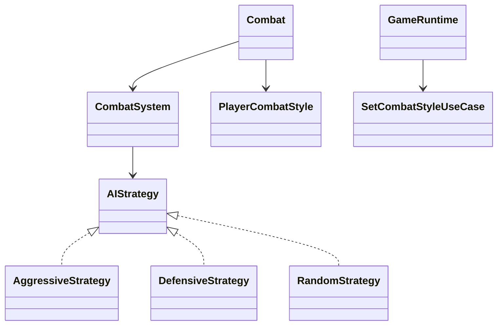

# Patron Strategy en Runtime

- Fecha de creacion: 2026-04-04
- Rama auditada: Flujo-de-mazmorra
- Estado: vigente

## Problema real que resuelve
El combate necesita comportamiento variable sin condicionales monoliticos: estrategia de IA enemiga y estilo tactico del jugador.

## Clases principales (rutas reales)
- `src/main/java/game/domain/combat/CombatSystem.java` (seleccion de estrategia enemiga)
- `src/main/java/game/ai/strategy/AIStrategy.java`
- `src/main/java/game/ai/strategy/AggressiveStrategy.java`
- `src/main/java/game/ai/strategy/DefensiveStrategy.java`
- `src/main/java/game/ai/strategy/RandomStrategy.java`
- `src/main/java/game/domain/combat/PlayerCombatStyle.java`
- `src/main/java/game/application/usecase/SetCombatStyleUseCase.java`
- `src/main/java/game/application/runtime/GameRuntime.java` (comando `setCombatStyle`)

## Conexion con runtime productivo
- En cada combate, `CombatSystem` determina/cambia estrategia de IA segun contexto.
- `GameRuntime` expone `setCombatStyle` para ajustar estrategia del jugador en caliente.
- El resultado afecta dano, mitigacion y consumo/recuperacion de recurso.

## Test de validacion en runtime real
- `src/test/java/game/unit/application/GameRuntimeExtendedCommandsTest.java`

## Diagrama minimo

